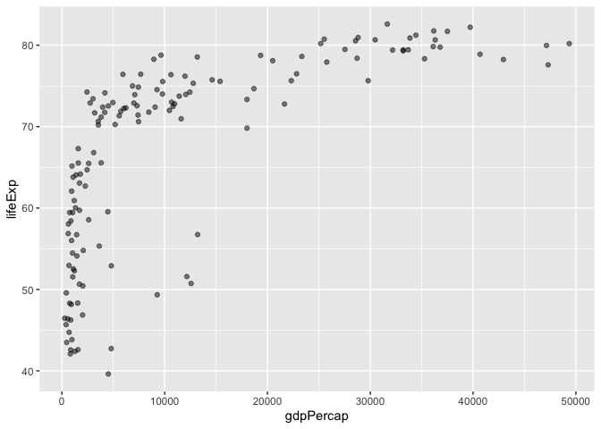

# Class 5 Data Visualization ggplot2
Christopher Brockie (PID: A16280405)

## Using GGPLOT

The ggplot2 package needs to be installed as it does not come with R
“out of the box”.

We use the `install.packages()` function to do this.

``` r
head(cars)
```

      speed dist
    1     4    2
    2     4   10
    3     7    4
    4     7   22
    5     8   16
    6     9   10

To use ggplot I need to load it up before I can call any of the
functions in the package. I do this with the `library()` function.

``` r
library(ggplot2)
ggplot()
```


All ggplot figures have at least 3 things: - data (the stuff we want to
plot) - aesthetic mapping (aes values) - geoms

``` r
ggplot(cars) +
  aes(x=speed, y=dist) +
  geom_point()
```


ggplot is not the only graphing system in R there are lots of others.
There is even “base R” graphics.

``` r
plot(cars)
```


Can you add a trend line layer to help show the relationship between the
plot variables with the `geom_smooth()` function?

``` r
ggplot(cars) +
  aes(x=speed, y=dist) +
  geom_point() +
  geom_smooth()
```

    `geom_smooth()` using method = 'loess' and formula = 'y ~ x'


Argue with `geom_smooth()` to add a straight line from a linear model
without the shaded standard error region?

``` r
ggplot(cars) +
  aes(x=speed, y=dist) +
  geom_point() +
  geom_smooth(method="lm", se=FALSE)
```

    `geom_smooth()` using formula = 'y ~ x'


Can you finish this plot by adding various label annotations with the
labs() function and changing the plot look to a more conservative “black
& white” theme by adding the `theme_bw()` function?

``` r
ggplot(cars) + 
  aes(x=speed, y=dist) +
  geom_point() +
  labs(title="Speed and Stopping Distances of Cars",
       x="Speed (MPH)", 
       y="Stopping Distance (ft)",
       subtitle = "Distance in feet it takes to stop given a speed in MPH",
       caption="Dataset: 'cars'") +
  geom_smooth(method="lm", se=FALSE) +
  theme_bw()
```

    `geom_smooth()` using formula = 'y ~ x'


Let’s turn for a moment to more relevant example data set. The code
below reads the results of a differential expression analysis where a
new anti-viral drug is being tested.

``` r
url <- "https://bioboot.github.io/bimm143_S20/class-material/up_down_expression.txt"
genes <- read.delim(url)
head(genes)
```

            Gene Condition1 Condition2      State
    1      A4GNT -3.6808610 -3.4401355 unchanging
    2       AAAS  4.5479580  4.3864126 unchanging
    3      AASDH  3.7190695  3.4787276 unchanging
    4       AATF  5.0784720  5.0151916 unchanging
    5       AATK  0.4711421  0.5598642 unchanging
    6 AB015752.4 -3.6808610 -3.5921390 unchanging

Use the `nrow()` function to find out how many genes are in this
dataset.

``` r
nrow(genes)
```

    [1] 5196

Use the `colnames()` function and the `ncol()` function on the `genes`
data frame to find out what the column names are (we will need these
later) and how many columns there are.

``` r
colnames(genes)
```

    [1] "Gene"       "Condition1" "Condition2" "State"     

``` r
ncol(genes)
```

    [1] 4

Use the `table()` function on the `State` column of this data.frame to
find out how many ‘up’ regulated genes there are.

``` r
table(genes$State)
```


          down unchanging         up 
            72       4997        127 

Using your values above and 2 significant figures. What fraction of
total genes is up-regulated in this dataset?

``` r
round( table(genes$State) / nrow(genes) * 100, 2)
```


          down unchanging         up 
          1.39      96.17       2.44 

We can make a first basic scatter plot of this dataset `genes` by
following the same recipe we have already seen, namely:

- Pass the genes data.frame as input to the ggplot() function.
- Then use the aes() function to set the x and y aesthetic mappings to
  the Condition1 and Condition2 columns.
- Finally add a geom_point() layer to add points to the plot.
- Don’t forget to add layers step-wise with the + operator at the end of
  each line.

``` r
ggplot(genes) + 
    aes(x=Condition1, y=Condition2) +
    geom_point()
```


There is extra information in this dataset, namely the `State` column,
which tells us whether the difference in expression values between
conditions is statistically significant. Let’s map this column to point
color:

``` r
p <- ggplot(genes) +
  aes(x=Condition1, y=Condition2, col=State) +
  geom_point()
p
```


I am not a big fan of these default colors so let’s change them up by
adding another layer to explicitly specify our color scale. Note how we
saved our previous plot as the object p and can use it now to add more
layers:

``` r
p + scale_colour_manual( values=c("blue", "gray", "red"))
```


Add some plot annotations to the p object with the `labs()` function:

``` r
p + 
  scale_colour_manual( values=c("blue", "gray", "red")) +
  labs(title="Gene Expression Changes Upon Drug Treatment",
       x="Control (no drug)", 
       y="Drug Treatment")
```


The gapminder dataset contains economic and demographic data about
various countries since 1952. It must be installed before it can be
used.

`install.packages("gapminder")` `library("gapminder)`

This dataset covers many years and many countries. Before we make some
plots we will use some dplyr code to focus in on a single year. It must
be installed before it can be used.

`install.packages("dplyr")` `library("dplyr")`

The following line takes gapminder data frame and filters to contain
only the rows with a year value of 2007.

``` r
library(gapminder)
library(dplyr)
```


    Attaching package: 'dplyr'

    The following objects are masked from 'package:stats':

        filter, lag

    The following objects are masked from 'package:base':

        intersect, setdiff, setequal, union

``` r
gapminder_2007 <- gapminder %>% filter(year==2007)
```

Consider the `gapminder_2007` dataset which contains the variables GDP
per capita gdpPercap and life expectancy lifeExp for 142 countries in
the year 2007. Below is a scatterplot of the `gapminder_2007` dataset.

``` r
ggplot(gapminder_2007) +
  aes(x=gdpPercap, y=lifeExp) +
  geom_point()
```


There are quite a few points that are nearly on top of each other in the
above plot. Add an `alpha=0.4` argument to your `geom_point()` call to
make the points slightly transparent.

``` r
ggplot(gapminder_2007) +
  aes(x=gdpPercap, y=lifeExp) +
  geom_point(alpha=0.5)
```



By mapping the `continent` variable to the point color aesthetic and the
population pop (in millions) through the point size argument to `aes()`
we can obtain a much richer plot that now includes 4 different variables
from the data set:

``` r
ggplot(gapminder_2007) +
  aes(x=gdpPercap, y=lifeExp, color=continent, size=pop) +
  geom_point(alpha=0.5)
```


See how the plot looks like if we color the points by the numeric
variable population pop:

``` r
ggplot(gapminder_2007) + 
  aes(x = gdpPercap, y = lifeExp, color = pop) +
  geom_point(alpha=0.8)
```


Plot the GDP per capita (x=gdpPercap) vs. the life expectancy
(y=lifeExp) and set the point size based on the population (size=pop) of
each country.

``` r
ggplot(gapminder_2007) + 
  aes(x = gdpPercap, y = lifeExp, size = pop) +
  geom_point(alpha=0.5)
```


To reflect the actual population differences by the point size we can
use the `scale_size_area()` function instead:

``` r
ggplot(gapminder_2007) + 
  geom_point(aes(x = gdpPercap, y = lifeExp,
                 size = pop), alpha=0.5) + 
  scale_size_area(max_size = 10)
```


Adapt the code you have learned thus far to reproduce our gapminder
scatter plot for the year 1957.

``` r
gapminder_1957 <- gapminder %>% filter(year==1957)

ggplot(gapminder_1957) +
  aes(x =gdpPercap, y = lifeExp, color = continent, size = pop) +
  geom_point(alpha = 0.7) +
  scale_size_area(max_size = 10)
```


Compare the plot of 1957 to that of 2007 by including the layer
`facet_wrap(~year)`:

``` r
gapminder_1957 <- gapminder %>% filter(year==1957 | year==2007)

ggplot(gapminder_1957) + 
  geom_point(aes(x = gdpPercap, y = lifeExp, color=continent,
                 size = pop), alpha=0.7) + 
  scale_size_area(max_size = 10) +
  facet_wrap(~year)
```


