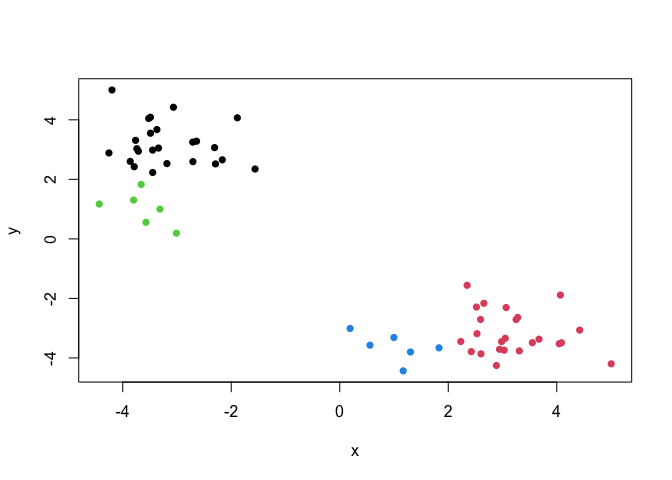

# Class 07: Machine Learning 1
Christopher Brockie (PID: A16280405)

# Clustering

We will start today’s lab with clustering methods, in particular
so-called K-means. The main function for this in R is `kmeans()`.

Let’s try it on some made up data where we know what the answer should
be.

``` r
x <- rnorm(10000, mean = 3)
hist(x)
```


60 points

``` r
tmp <- c(rnorm(30, mean = 3), rnorm(30, mean = -3))
x <- cbind(x = tmp, y = rev(tmp))
head(x)
```

                x         y
    [1,] 0.557037 -3.571974
    [2,] 2.424093 -3.788407
    [3,] 4.086374 -3.489336
    [4,] 2.594946 -2.706567
    [5,] 3.030981 -3.739706
    [6,] 3.050685 -3.340581

We can pass this to the base R `plot()` function for a quick plot

``` r
plot(x)
```


``` r
k <- kmeans(x, centers = 2, nstart = 20)
k
```

    K-means clustering with 2 clusters of sizes 30, 30

    Cluster means:
              x         y
    1 -3.257656  2.753412
    2  2.753412 -3.257656

    Clustering vector:
     [1] 2 2 2 2 2 2 2 2 2 2 2 2 2 2 2 2 2 2 2 2 2 2 2 2 2 2 2 2 2 2 1 1 1 1 1 1 1 1
    [39] 1 1 1 1 1 1 1 1 1 1 1 1 1 1 1 1 1 1 1 1 1 1

    Within cluster sum of squares by cluster:
    [1] 50.65504 50.65504
     (between_SS / total_SS =  91.5 %)

    Available components:

    [1] "cluster"      "centers"      "totss"        "withinss"     "tot.withinss"
    [6] "betweenss"    "size"         "iter"         "ifault"      

> Q1. How many points are in each cluster?

``` r
k$size
```

    [1] 30 30

> Q2. Cluster membership?

``` r
k$cluster
```

     [1] 2 2 2 2 2 2 2 2 2 2 2 2 2 2 2 2 2 2 2 2 2 2 2 2 2 2 2 2 2 2 1 1 1 1 1 1 1 1
    [39] 1 1 1 1 1 1 1 1 1 1 1 1 1 1 1 1 1 1 1 1 1 1

> Q3. Cluster centers?

``` r
k$centers
```

              x         y
    1 -3.257656  2.753412
    2  2.753412 -3.257656

> Q4. Plot my clustering results.

``` r
plot(x, col = k$cluster, pch = 16)
```


> Q5. Cluster the data again with `kmeans()` into 4 groups and plot the
> results.

``` r
k4 <- kmeans(x, centers = 4, nstart = 20)
plot(x, col = k4$cluster, pch = 16)
```



K-means is very popular mostly because it is fast and relatively
straight-forward to run and understand. It has a big limitation in that
you need to tell it how many groups (k, or centers) you want.

# Hierarchical Clustering

The main function in base R is called `hclust()`. You have to pass it in
a distance matrix not just your input data.

You can generate a distance matrix with the `dist()` function.

``` r
hc <- hclust(dist(x))
hc
```


    Call:
    hclust(d = dist(x))

    Cluster method   : complete 
    Distance         : euclidean 
    Number of objects: 60 

To find the clusters (cluster membership vector) from a `hclust()`
result we can “cut” the tree at a certain height that we like. For this
we use the `cutree()` function.

``` r
plot(hc)
abline(h=8, col="red")
```


``` r
grps <- cutree(hc, h=8)
```

``` r
table(grps)
```

    grps
     1  2 
    30 30 

> Q6. Plot our hclust results.

``` r
plot(x, col=grps, pch=16)
```


# Principal Component Analysis

## PCA of UK food data

Suppose that we are examining the following data, from the UK’s
‘Department for Environment, Food and Rural Affairs’ (DEFRA), showing
the consumption in grams (per person, per week) of 17 different types of
food-stuff measured and averaged in the four countries of the United
Kingdom in 1997.

Lets see how PCA can help with conventional analysis.

``` r
url <- "https://tinyurl.com/UK-foods"
x <- read.csv(url)
```

> Q1. How many rows and columns are in your new data frame named x? What
> R functions could you use to answer this questions?

``` r
dim(x)
```

    [1] 17  5

Preview the first 6 rows:

``` r
head(x)
```

                   X England Wales Scotland N.Ireland
    1         Cheese     105   103      103        66
    2  Carcass_meat      245   227      242       267
    3    Other_meat      685   803      750       586
    4           Fish     147   160      122        93
    5 Fats_and_oils      193   235      184       209
    6         Sugars     156   175      147       139

Here it appears that the row-names are incorrectly set as the first
column of our x data frame (rather than set as proper row-names). This
is very common error. Lets try to fix this up with the following code,
which sets the rownames() to the first column and then removes the
troublesome first column (with the -1 column index):

``` r
# Note how the minus indexing works
rownames(x) <- x[,1]
x <- x[,-1]
head(x)
```

                   England Wales Scotland N.Ireland
    Cheese             105   103      103        66
    Carcass_meat       245   227      242       267
    Other_meat         685   803      750       586
    Fish               147   160      122        93
    Fats_and_oils      193   235      184       209
    Sugars             156   175      147       139

Check the dimensions again; Notice how we now have 4 columns instead of
5.

``` r
dim(x)
```

    [1] 17  4

An alternative approach to setting the correct row-names in this case
would be to read the data file again and this time set the row.names
argument of read.csv() to be the first column (i.e. use argument setting
row.names=1), see below:

``` r
x <- read.csv(url, row.names=1)
head(x)
```

                   England Wales Scotland N.Ireland
    Cheese             105   103      103        66
    Carcass_meat       245   227      242       267
    Other_meat         685   803      750       586
    Fish               147   160      122        93
    Fats_and_oils      193   235      184       209
    Sugars             156   175      147       139

> Q2. Which approach to solving the ‘row-names problem’ mentioned above
> do you prefer and why? Is one approach more robust than another under
> certain circumstances?

*The second approach is definitely better because it avoids overwriting
the dataset; Everytime you run the code with the \[-1\] syntax, it
deletes a column from the dataset.*

A cursory glance over the numbers in this table does not reveal much of
anything. Indeed in general it is difficult to extract meaning in regard
to major differences and trends from any given array of numbers.
Generating regular bar-plots and various pairwise plots does not help
too much either:

``` r
barplot(as.matrix(x), beside=T, col=rainbow(nrow(x)))
```


> Q3: Changing what optional argument in the above barplot() function
> results in the following plot?

``` r
barplot(as.matrix(x), beside=F, col=rainbow(nrow(x)))
```


> Q5: Generating all pairwise plots may help somewhat. Can you make
> sense of the following code and resulting figure? What does it mean if
> a given point lies on the diagonal for a given plot?

``` r
pairs(x, col=rainbow(10), pch=16)
```


*The plot where each country intersects represents a comparison plot
between the two countries. For example, the plot below England plots the
x-axis of England against the y-axis of Wales. If points lie on the
diagonal of the plot, that means that the data from the two countries
being compared are very similar.*

> Q6. What is the main differences between N. Ireland and the other
> countries of the UK in terms of this data-set?

*When plotted against N. Ireland, points lie off of the diagonal,
suggesting a greater difference in the food consumption in this
country.*

## Principal Component Analysis (PCA)

PCA can help us make sense of these types of datasets. Let’s see how it
works.

The main function in “base” R is called `prcomp()`. In this case we want
to first take the transpose `t()` of our input `x` so the columns are
the food types and the countries are the rows.

``` r
head(t(x))
```

              Cheese Carcass_meat  Other_meat  Fish Fats_and_oils  Sugars
    England      105           245         685  147            193    156
    Wales        103           227         803  160            235    175
    Scotland     103           242         750  122            184    147
    N.Ireland     66           267         586   93            209    139
              Fresh_potatoes  Fresh_Veg  Other_Veg  Processed_potatoes 
    England               720        253        488                 198
    Wales                 874        265        570                 203
    Scotland              566        171        418                 220
    N.Ireland            1033        143        355                 187
              Processed_Veg  Fresh_fruit  Cereals  Beverages Soft_drinks 
    England              360         1102     1472        57         1374
    Wales                365         1137     1582        73         1256
    Scotland             337          957     1462        53         1572
    N.Ireland            334          674     1494        47         1506
              Alcoholic_drinks  Confectionery 
    England                 375             54
    Wales                   475             64
    Scotland                458             62
    N.Ireland               135             41

``` r
pca <- prcomp(t(x))
summary(pca)
```

    Importance of components:
                                PC1      PC2      PC3       PC4
    Standard deviation     324.1502 212.7478 73.87622 3.176e-14
    Proportion of Variance   0.6744   0.2905  0.03503 0.000e+00
    Cumulative Proportion    0.6744   0.9650  1.00000 1.000e+00

> Q7. Complete the code below to generate a plot of PC1 vs PC2. The
> second line adds text labels over the data points.

``` r
# Plot PC1 vs PC2
plot(pca$x[,1], pca$x[,2], col=c("orange", "red", "blue", "darkgreen"), pch=16, xlab="PC1", ylab="PC2", xlim=c(-270,500))
text(pca$x[,1], pca$x[,2], colnames(x))
```


> Q8. Customize your plot so that the colors of the country names match
> the colors in our UK and Ireland map and table at start of this
> document.

``` r
plot(pca$x[,1], pca$x[,2], col=c("orange", "red", "blue", "darkgreen"), pch=16, xlab="PC1", ylab="PC2", xlim=c(-270,500))
text(pca$x[,1], pca$x[,2], colnames(x), col=c("orange", "red", "blue", "darkgreen"))
```


Below we can use the square of pca\$sdev , which stands for “standard
deviation”, to calculate how much variation in the original data each PC
accounts for.

``` r
v <- round( pca$sdev^2/sum(pca$sdev^2) * 100 )
v
```

    [1] 67 29  4  0

``` r
## or the second row here...
z <- summary(pca)
z$importance
```

                                 PC1       PC2      PC3          PC4
    Standard deviation     324.15019 212.74780 73.87622 3.175833e-14
    Proportion of Variance   0.67444   0.29052  0.03503 0.000000e+00
    Cumulative Proportion    0.67444   0.96497  1.00000 1.000000e+00

This information can be summarized in a plot of the variances
(eigenvalues) with respect to the principal component number
(eigenvector number), which is given below.

``` r
barplot(v, xlab="Principal Component", ylab="Percent Variation")
```


We can also consider the influence of each of the original variables
upon the principal components (typically known as loading scores). This
information can be obtained from the prcomp() returned \$rotation
component. It can also be summarized with a call to biplot(), see below:

``` r
## Lets focus on PC1 as it accounts for > 90% of variance 
par(mar=c(10, 3, 0.35, 0))
barplot( pca$rotation[,1], las=2 )
```


Here we see observations (foods) with the largest positive loading
scores that effectively “push” N. Ireland to right positive side of the
plot (including Fresh_potatoes and Soft_drinks).

We can also see the observations/foods with high negative scores that
push the other countries to the left side of the plot (including
Fresh_fruit and Alcoholic_drinks).

> Q9: Generate a similar ‘loadings plot’ for PC2. What two food groups
> feature prominantly and what does PC2 maninly tell us about?

``` r
## Lets focus on PC2
par(mar=c(10, 3, 0.35, 0))
barplot( pca$rotation[,2], las=2 )
```


*This plot predominantly features “Fresh_potatoes” and “Soft_drinks”.
This tells us that Wales consumes more fresh potatoes while Scotland
consumes more soft drinks.*
