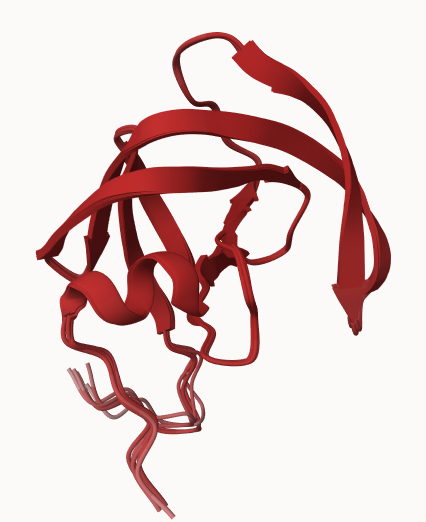
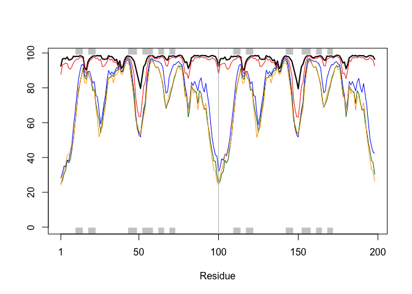
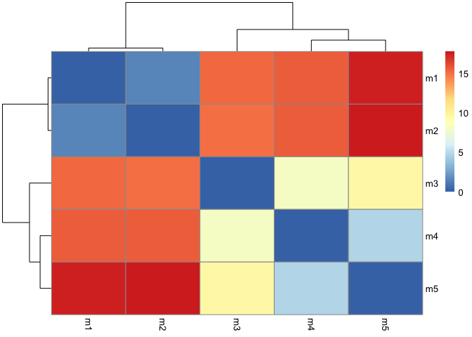
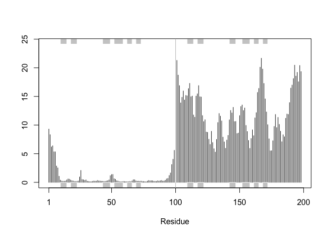
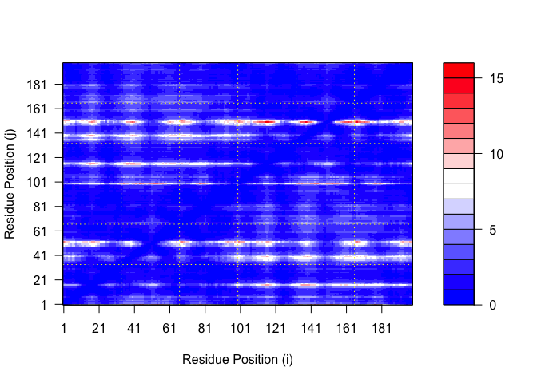
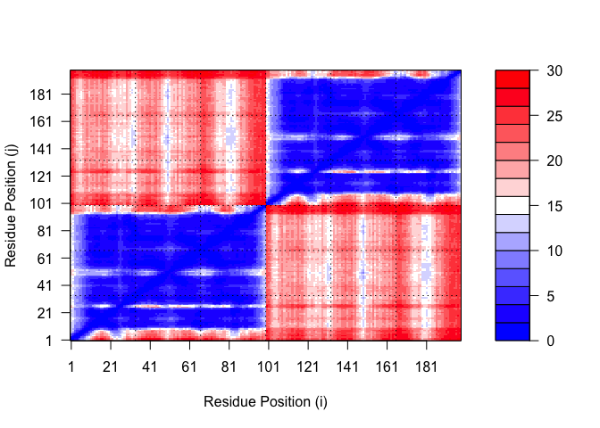
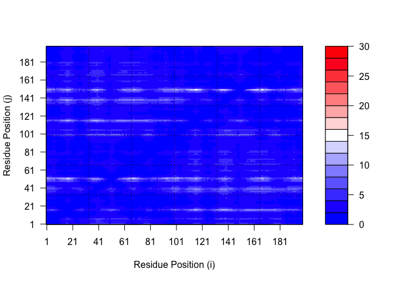
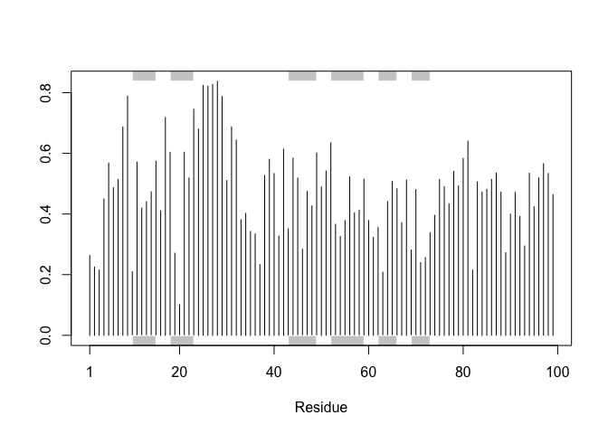

# Class 11: Comparative Analysis of Structures
Christopher Brockie (PID: A16280405)

We need some packages for todays class. These include `bio3d` and `msa`.

The `msa` package is from BioConductor. These packages focus on genomics
type work and are managed by the `BiocManager` package.

Install `install.packages("BiocManager")` and then
`BiocManager::install("msa")` all entered in the R “brain” console.

``` r
library(bio3d)

aa <- get.seq("1ake_A")
```

    Warning in get.seq("1ake_A"): Removing existing file: seqs.fasta

    Fetching... Please wait. Done.

``` r
aa
```

                 1        .         .         .         .         .         60 
    pdb|1AKE|A   MRIILLGAPGAGKGTQAQFIMEKYGIPQISTGDMLRAAVKSGSELGKQAKDIMDAGKLVT
                 1        .         .         .         .         .         60 

                61        .         .         .         .         .         120 
    pdb|1AKE|A   DELVIALVKERIAQEDCRNGFLLDGFPRTIPQADAMKEAGINVDYVLEFDVPDELIVDRI
                61        .         .         .         .         .         120 

               121        .         .         .         .         .         180 
    pdb|1AKE|A   VGRRVHAPSGRVYHVKFNPPKVEGKDDVTGEELTTRKDDQEETVRKRLVEYHQMTAPLIG
               121        .         .         .         .         .         180 

               181        .         .         .   214 
    pdb|1AKE|A   YYSKEAEAGNTKYAKVDGTKPVAEVRADLEKILG
               181        .         .         .   214 

    Call:
      read.fasta(file = outfile)

    Class:
      fasta

    Alignment dimensions:
      1 sequence rows; 214 position columns (214 non-gap, 0 gap) 

    + attr: id, ali, call

> Q10. Which of the packages above is found only on BioConductor and not
> CRAN?

**msa**

> Q11. Which of the above packages is not found on BioConductor or CRAN?

**devtools**

> Q12. True or False? Functions from the devtools package can be used to
> install packages from GitHub and BitBucket?

**TRUE**

> Q13. How many amino acids are in this sequence, i.e. how long is this
> sequence?

**214**

Now I can search the PDB database for related sequences:

``` r
#b <- blast.pdb(aa)
```

``` r
#hits <- plot(b)
```

These are the related structures in the PDB database that we found via a
BLAST search…

``` r
hits <- NULL
hits$pdb.id <- c('1AKE_A','6S36_A','6RZE_A','3HPR_A','1E4V_A','5EJE_A','1E4Y_A','3X2S_A','6HAP_A','6HAM_A','4K46_A','3GMT_A','4PZL_A')
hits$pdb.id
```

     [1] "1AKE_A" "6S36_A" "6RZE_A" "3HPR_A" "1E4V_A" "5EJE_A" "1E4Y_A" "3X2S_A"
     [9] "6HAP_A" "6HAM_A" "4K46_A" "3GMT_A" "4PZL_A"

Side-note: Lets annotate these structures (in other words find out what
they are, what species they are from, stuff about the experiment they
were solved in, etc.)

For this we can use the `pdb.annotate()` function

``` r
anno <- pdb.annotate(hits$pdb.id)
```

``` r
#attributes(anno)
#head(anno)
```

Now we can download all these structures for further analysis with the
`get.pdb()` function.

``` r
# Download releated PDB files
files <- get.pdb(hits$pdb.id, path="pdbs", split=TRUE, gzip=TRUE)
```

    Warning in get.pdb(hits$pdb.id, path = "pdbs", split = TRUE, gzip = TRUE):
    pdbs/1AKE.pdb.gz exists. Skipping download

    Warning in get.pdb(hits$pdb.id, path = "pdbs", split = TRUE, gzip = TRUE):
    pdbs/6S36.pdb.gz exists. Skipping download

    Warning in get.pdb(hits$pdb.id, path = "pdbs", split = TRUE, gzip = TRUE):
    pdbs/6RZE.pdb.gz exists. Skipping download

    Warning in get.pdb(hits$pdb.id, path = "pdbs", split = TRUE, gzip = TRUE):
    pdbs/3HPR.pdb.gz exists. Skipping download

    Warning in get.pdb(hits$pdb.id, path = "pdbs", split = TRUE, gzip = TRUE):
    pdbs/1E4V.pdb.gz exists. Skipping download

    Warning in get.pdb(hits$pdb.id, path = "pdbs", split = TRUE, gzip = TRUE):
    pdbs/5EJE.pdb.gz exists. Skipping download

    Warning in get.pdb(hits$pdb.id, path = "pdbs", split = TRUE, gzip = TRUE):
    pdbs/1E4Y.pdb.gz exists. Skipping download

    Warning in get.pdb(hits$pdb.id, path = "pdbs", split = TRUE, gzip = TRUE):
    pdbs/3X2S.pdb.gz exists. Skipping download

    Warning in get.pdb(hits$pdb.id, path = "pdbs", split = TRUE, gzip = TRUE):
    pdbs/6HAP.pdb.gz exists. Skipping download

    Warning in get.pdb(hits$pdb.id, path = "pdbs", split = TRUE, gzip = TRUE):
    pdbs/6HAM.pdb.gz exists. Skipping download

    Warning in get.pdb(hits$pdb.id, path = "pdbs", split = TRUE, gzip = TRUE):
    pdbs/4K46.pdb.gz exists. Skipping download

    Warning in get.pdb(hits$pdb.id, path = "pdbs", split = TRUE, gzip = TRUE):
    pdbs/3GMT.pdb.gz exists. Skipping download

    Warning in get.pdb(hits$pdb.id, path = "pdbs", split = TRUE, gzip = TRUE):
    pdbs/4PZL.pdb.gz exists. Skipping download


      |                                                                            
      |                                                                      |   0%
      |                                                                            
      |=====                                                                 |   8%
      |                                                                            
      |===========                                                           |  15%
      |                                                                            
      |================                                                      |  23%
      |                                                                            
      |======================                                                |  31%
      |                                                                            
      |===========================                                           |  38%
      |                                                                            
      |================================                                      |  46%
      |                                                                            
      |======================================                                |  54%
      |                                                                            
      |===========================================                           |  62%
      |                                                                            
      |================================================                      |  69%
      |                                                                            
      |======================================================                |  77%
      |                                                                            
      |===========================================================           |  85%
      |                                                                            
      |=================================================================     |  92%
      |                                                                            
      |======================================================================| 100%

Now we have all these related structures we can Align and Supperpose…

``` r
# Align releated PDBs
pdbs <- pdbaln(files, fit = TRUE, exefile="msa")
```

    Reading PDB files:
    pdbs/split_chain/1AKE_A.pdb
    pdbs/split_chain/6S36_A.pdb
    pdbs/split_chain/6RZE_A.pdb
    pdbs/split_chain/3HPR_A.pdb
    pdbs/split_chain/1E4V_A.pdb
    pdbs/split_chain/5EJE_A.pdb
    pdbs/split_chain/1E4Y_A.pdb
    pdbs/split_chain/3X2S_A.pdb
    pdbs/split_chain/6HAP_A.pdb
    pdbs/split_chain/6HAM_A.pdb
    pdbs/split_chain/4K46_A.pdb
    pdbs/split_chain/3GMT_A.pdb
    pdbs/split_chain/4PZL_A.pdb
       PDB has ALT records, taking A only, rm.alt=TRUE
    .   PDB has ALT records, taking A only, rm.alt=TRUE
    .   PDB has ALT records, taking A only, rm.alt=TRUE
    .   PDB has ALT records, taking A only, rm.alt=TRUE
    ..   PDB has ALT records, taking A only, rm.alt=TRUE
    ....   PDB has ALT records, taking A only, rm.alt=TRUE
    .   PDB has ALT records, taking A only, rm.alt=TRUE
    ...

    Extracting sequences

    pdb/seq: 1   name: pdbs/split_chain/1AKE_A.pdb 
       PDB has ALT records, taking A only, rm.alt=TRUE
    pdb/seq: 2   name: pdbs/split_chain/6S36_A.pdb 
       PDB has ALT records, taking A only, rm.alt=TRUE
    pdb/seq: 3   name: pdbs/split_chain/6RZE_A.pdb 
       PDB has ALT records, taking A only, rm.alt=TRUE
    pdb/seq: 4   name: pdbs/split_chain/3HPR_A.pdb 
       PDB has ALT records, taking A only, rm.alt=TRUE
    pdb/seq: 5   name: pdbs/split_chain/1E4V_A.pdb 
    pdb/seq: 6   name: pdbs/split_chain/5EJE_A.pdb 
       PDB has ALT records, taking A only, rm.alt=TRUE
    pdb/seq: 7   name: pdbs/split_chain/1E4Y_A.pdb 
    pdb/seq: 8   name: pdbs/split_chain/3X2S_A.pdb 
    pdb/seq: 9   name: pdbs/split_chain/6HAP_A.pdb 
    pdb/seq: 10   name: pdbs/split_chain/6HAM_A.pdb 
       PDB has ALT records, taking A only, rm.alt=TRUE
    pdb/seq: 11   name: pdbs/split_chain/4K46_A.pdb 
       PDB has ALT records, taking A only, rm.alt=TRUE
    pdb/seq: 12   name: pdbs/split_chain/3GMT_A.pdb 
    pdb/seq: 13   name: pdbs/split_chain/4PZL_A.pdb 

``` r
pdbs
```

                                    1        .         .         .         40 
    [Truncated_Name:1]1AKE_A.pdb    ----------MRIILLGAPGAGKGTQAQFIMEKYGIPQIS
    [Truncated_Name:2]6S36_A.pdb    ----------MRIILLGAPGAGKGTQAQFIMEKYGIPQIS
    [Truncated_Name:3]6RZE_A.pdb    ----------MRIILLGAPGAGKGTQAQFIMEKYGIPQIS
    [Truncated_Name:4]3HPR_A.pdb    ----------MRIILLGAPGAGKGTQAQFIMEKYGIPQIS
    [Truncated_Name:5]1E4V_A.pdb    ----------MRIILLGAPVAGKGTQAQFIMEKYGIPQIS
    [Truncated_Name:6]5EJE_A.pdb    ----------MRIILLGAPGAGKGTQAQFIMEKYGIPQIS
    [Truncated_Name:7]1E4Y_A.pdb    ----------MRIILLGALVAGKGTQAQFIMEKYGIPQIS
    [Truncated_Name:8]3X2S_A.pdb    ----------MRIILLGAPGAGKGTQAQFIMEKYGIPQIS
    [Truncated_Name:9]6HAP_A.pdb    ----------MRIILLGAPGAGKGTQAQFIMEKYGIPQIS
    [Truncated_Name:10]6HAM_A.pdb   ----------MRIILLGAPGAGKGTQAQFIMEKYGIPQIS
    [Truncated_Name:11]4K46_A.pdb   ----------MRIILLGAPGAGKGTQAQFIMAKFGIPQIS
    [Truncated_Name:12]3GMT_A.pdb   ----------MRLILLGAPGAGKGTQANFIKEKFGIPQIS
    [Truncated_Name:13]4PZL_A.pdb   TENLYFQSNAMRIILLGAPGAGKGTQAKIIEQKYNIAHIS
                                              **^*****  *******  *  *^ *  ** 
                                    1        .         .         .         40 

                                   41        .         .         .         80 
    [Truncated_Name:1]1AKE_A.pdb    TGDMLRAAVKSGSELGKQAKDIMDAGKLVTDELVIALVKE
    [Truncated_Name:2]6S36_A.pdb    TGDMLRAAVKSGSELGKQAKDIMDAGKLVTDELVIALVKE
    [Truncated_Name:3]6RZE_A.pdb    TGDMLRAAVKSGSELGKQAKDIMDAGKLVTDELVIALVKE
    [Truncated_Name:4]3HPR_A.pdb    TGDMLRAAVKSGSELGKQAKDIMDAGKLVTDELVIALVKE
    [Truncated_Name:5]1E4V_A.pdb    TGDMLRAAVKSGSELGKQAKDIMDAGKLVTDELVIALVKE
    [Truncated_Name:6]5EJE_A.pdb    TGDMLRAAVKSGSELGKQAKDIMDACKLVTDELVIALVKE
    [Truncated_Name:7]1E4Y_A.pdb    TGDMLRAAVKSGSELGKQAKDIMDAGKLVTDELVIALVKE
    [Truncated_Name:8]3X2S_A.pdb    TGDMLRAAVKSGSELGKQAKDIMDCGKLVTDELVIALVKE
    [Truncated_Name:9]6HAP_A.pdb    TGDMLRAAVKSGSELGKQAKDIMDAGKLVTDELVIALVRE
    [Truncated_Name:10]6HAM_A.pdb   TGDMLRAAIKSGSELGKQAKDIMDAGKLVTDEIIIALVKE
    [Truncated_Name:11]4K46_A.pdb   TGDMLRAAIKAGTELGKQAKSVIDAGQLVSDDIILGLVKE
    [Truncated_Name:12]3GMT_A.pdb   TGDMLRAAVKAGTPLGVEAKTYMDEGKLVPDSLIIGLVKE
    [Truncated_Name:13]4PZL_A.pdb   TGDMIRETIKSGSALGQELKKVLDAGELVSDEFIIKIVKD
                                    ****^*  ^* *^ **   *  ^*   ** *  ^^ ^*^^ 
                                   41        .         .         .         80 

                                   81        .         .         .         120 
    [Truncated_Name:1]1AKE_A.pdb    RIAQEDCRNGFLLDGFPRTIPQADAMKEAGINVDYVLEFD
    [Truncated_Name:2]6S36_A.pdb    RIAQEDCRNGFLLDGFPRTIPQADAMKEAGINVDYVLEFD
    [Truncated_Name:3]6RZE_A.pdb    RIAQEDCRNGFLLDGFPRTIPQADAMKEAGINVDYVLEFD
    [Truncated_Name:4]3HPR_A.pdb    RIAQEDCRNGFLLDGFPRTIPQADAMKEAGINVDYVLEFD
    [Truncated_Name:5]1E4V_A.pdb    RIAQEDCRNGFLLDGFPRTIPQADAMKEAGINVDYVLEFD
    [Truncated_Name:6]5EJE_A.pdb    RIAQEDCRNGFLLDGFPRTIPQADAMKEAGINVDYVLEFD
    [Truncated_Name:7]1E4Y_A.pdb    RIAQEDCRNGFLLDGFPRTIPQADAMKEAGINVDYVLEFD
    [Truncated_Name:8]3X2S_A.pdb    RIAQEDSRNGFLLDGFPRTIPQADAMKEAGINVDYVLEFD
    [Truncated_Name:9]6HAP_A.pdb    RICQEDSRNGFLLDGFPRTIPQADAMKEAGINVDYVLEFD
    [Truncated_Name:10]6HAM_A.pdb   RICQEDSRNGFLLDGFPRTIPQADAMKEAGINVDYVLEFD
    [Truncated_Name:11]4K46_A.pdb   RIAQDDCAKGFLLDGFPRTIPQADGLKEVGVVVDYVIEFD
    [Truncated_Name:12]3GMT_A.pdb   RLKEADCANGYLFDGFPRTIAQADAMKEAGVAIDYVLEID
    [Truncated_Name:13]4PZL_A.pdb   RISKNDCNNGFLLDGVPRTIPQAQELDKLGVNIDYIVEVD
                                    *^   *   *^* ** **** **  ^   *^ ^**^^* * 
                                   81        .         .         .         120 

                                  121        .         .         .         160 
    [Truncated_Name:1]1AKE_A.pdb    VPDELIVDRIVGRRVHAPSGRVYHVKFNPPKVEGKDDVTG
    [Truncated_Name:2]6S36_A.pdb    VPDELIVDKIVGRRVHAPSGRVYHVKFNPPKVEGKDDVTG
    [Truncated_Name:3]6RZE_A.pdb    VPDELIVDAIVGRRVHAPSGRVYHVKFNPPKVEGKDDVTG
    [Truncated_Name:4]3HPR_A.pdb    VPDELIVDRIVGRRVHAPSGRVYHVKFNPPKVEGKDDGTG
    [Truncated_Name:5]1E4V_A.pdb    VPDELIVDRIVGRRVHAPSGRVYHVKFNPPKVEGKDDVTG
    [Truncated_Name:6]5EJE_A.pdb    VPDELIVDRIVGRRVHAPSGRVYHVKFNPPKVEGKDDVTG
    [Truncated_Name:7]1E4Y_A.pdb    VPDELIVDRIVGRRVHAPSGRVYHVKFNPPKVEGKDDVTG
    [Truncated_Name:8]3X2S_A.pdb    VPDELIVDRIVGRRVHAPSGRVYHVKFNPPKVEGKDDVTG
    [Truncated_Name:9]6HAP_A.pdb    VPDELIVDRIVGRRVHAPSGRVYHVKFNPPKVEGKDDVTG
    [Truncated_Name:10]6HAM_A.pdb   VPDELIVDRIVGRRVHAPSGRVYHVKFNPPKVEGKDDVTG
    [Truncated_Name:11]4K46_A.pdb   VADSVIVERMAGRRAHLASGRTYHNVYNPPKVEGKDDVTG
    [Truncated_Name:12]3GMT_A.pdb   VPFSEIIERMSGRRTHPASGRTYHVKFNPPKVEGKDDVTG
    [Truncated_Name:13]4PZL_A.pdb   VADNLLIERITGRRIHPASGRTYHTKFNPPKVADKDDVTG
                                    *    ^^^ ^ *** *  *** **  ^*****  *** ** 
                                  121        .         .         .         160 

                                  161        .         .         .         200 
    [Truncated_Name:1]1AKE_A.pdb    EELTTRKDDQEETVRKRLVEYHQMTAPLIGYYSKEAEAGN
    [Truncated_Name:2]6S36_A.pdb    EELTTRKDDQEETVRKRLVEYHQMTAPLIGYYSKEAEAGN
    [Truncated_Name:3]6RZE_A.pdb    EELTTRKDDQEETVRKRLVEYHQMTAPLIGYYSKEAEAGN
    [Truncated_Name:4]3HPR_A.pdb    EELTTRKDDQEETVRKRLVEYHQMTAPLIGYYSKEAEAGN
    [Truncated_Name:5]1E4V_A.pdb    EELTTRKDDQEETVRKRLVEYHQMTAPLIGYYSKEAEAGN
    [Truncated_Name:6]5EJE_A.pdb    EELTTRKDDQEECVRKRLVEYHQMTAPLIGYYSKEAEAGN
    [Truncated_Name:7]1E4Y_A.pdb    EELTTRKDDQEETVRKRLVEYHQMTAPLIGYYSKEAEAGN
    [Truncated_Name:8]3X2S_A.pdb    EELTTRKDDQEETVRKRLCEYHQMTAPLIGYYSKEAEAGN
    [Truncated_Name:9]6HAP_A.pdb    EELTTRKDDQEETVRKRLVEYHQMTAPLIGYYSKEAEAGN
    [Truncated_Name:10]6HAM_A.pdb   EELTTRKDDQEETVRKRLVEYHQMTAPLIGYYSKEAEAGN
    [Truncated_Name:11]4K46_A.pdb   EDLVIREDDKEETVLARLGVYHNQTAPLIAYYGKEAEAGN
    [Truncated_Name:12]3GMT_A.pdb   EPLVQRDDDKEETVKKRLDVYEAQTKPLITYYGDWARRGA
    [Truncated_Name:13]4PZL_A.pdb   EPLITRTDDNEDTVKQRLSVYHAQTAKLIDFYRNFSSTNT
                                    * *  * ** *^ *  **  *   *  ** ^*         
                                  161        .         .         .         200 

                                  201        .         .      227 
    [Truncated_Name:1]1AKE_A.pdb    T--KYAKVDGTKPVAEVRADLEKILG-
    [Truncated_Name:2]6S36_A.pdb    T--KYAKVDGTKPVAEVRADLEKILG-
    [Truncated_Name:3]6RZE_A.pdb    T--KYAKVDGTKPVAEVRADLEKILG-
    [Truncated_Name:4]3HPR_A.pdb    T--KYAKVDGTKPVAEVRADLEKILG-
    [Truncated_Name:5]1E4V_A.pdb    T--KYAKVDGTKPVAEVRADLEKILG-
    [Truncated_Name:6]5EJE_A.pdb    T--KYAKVDGTKPVAEVRADLEKILG-
    [Truncated_Name:7]1E4Y_A.pdb    T--KYAKVDGTKPVAEVRADLEKILG-
    [Truncated_Name:8]3X2S_A.pdb    T--KYAKVDGTKPVAEVRADLEKILG-
    [Truncated_Name:9]6HAP_A.pdb    T--KYAKVDGTKPVCEVRADLEKILG-
    [Truncated_Name:10]6HAM_A.pdb   T--KYAKVDGTKPVCEVRADLEKILG-
    [Truncated_Name:11]4K46_A.pdb   T--QYLKFDGTKAVAEVSAELEKALA-
    [Truncated_Name:12]3GMT_A.pdb   E-------NGLKAPA-----YRKISG-
    [Truncated_Name:13]4PZL_A.pdb   KIPKYIKINGDQAVEKVSQDIFDQLNK
                                             *                  
                                  201        .         .      227 

    Call:
      pdbaln(files = files, fit = TRUE, exefile = "msa")

    Class:
      pdbs, fasta

    Alignment dimensions:
      13 sequence rows; 227 position columns (204 non-gap, 23 gap) 

    + attr: xyz, resno, b, chain, id, ali, resid, sse, call

## Principal Component Analysis

``` r
# Perform PCA
pc.xray <- pca(pdbs)
plot(pc.xray)
```


``` r
# Visualize first principal component
pc1 <- mktrj(pc.xray, pc=1, file="pc_1.pdb")
```

# Protein Structure Prediction with AlphaFold



## Custom Analysis of Resulting Models

For tidiness we can move our AlphaFold results directory into our
RStudio project directory. In this example my results are in the
director `results_dir`

``` r
results_dir <- "hivpr_dimer_23119/"
```

``` r
# File names for all PDB models
pdb_files <- list.files(path=results_dir,
                        pattern="*.pdb",
                        full.names = TRUE)
pdb_files
```

    [1] "hivpr_dimer_23119//hivpr_dimer_23119_unrelaxed_rank_001_alphafold2_multimer_v3_model_1_seed_000.pdb"
    [2] "hivpr_dimer_23119//hivpr_dimer_23119_unrelaxed_rank_002_alphafold2_multimer_v3_model_5_seed_000.pdb"
    [3] "hivpr_dimer_23119//hivpr_dimer_23119_unrelaxed_rank_003_alphafold2_multimer_v3_model_4_seed_000.pdb"
    [4] "hivpr_dimer_23119//hivpr_dimer_23119_unrelaxed_rank_004_alphafold2_multimer_v3_model_2_seed_000.pdb"
    [5] "hivpr_dimer_23119//hivpr_dimer_23119_unrelaxed_rank_005_alphafold2_multimer_v3_model_3_seed_000.pdb"

``` r
library(bio3d)

# Read all data from Models 
#  and superpose/fit coords
pdbs <- pdbaln(pdb_files, fit=TRUE, exefile="msa")
```

    Reading PDB files:
    hivpr_dimer_23119//hivpr_dimer_23119_unrelaxed_rank_001_alphafold2_multimer_v3_model_1_seed_000.pdb
    hivpr_dimer_23119//hivpr_dimer_23119_unrelaxed_rank_002_alphafold2_multimer_v3_model_5_seed_000.pdb
    hivpr_dimer_23119//hivpr_dimer_23119_unrelaxed_rank_003_alphafold2_multimer_v3_model_4_seed_000.pdb
    hivpr_dimer_23119//hivpr_dimer_23119_unrelaxed_rank_004_alphafold2_multimer_v3_model_2_seed_000.pdb
    hivpr_dimer_23119//hivpr_dimer_23119_unrelaxed_rank_005_alphafold2_multimer_v3_model_3_seed_000.pdb
    .....

    Extracting sequences

    pdb/seq: 1   name: hivpr_dimer_23119//hivpr_dimer_23119_unrelaxed_rank_001_alphafold2_multimer_v3_model_1_seed_000.pdb 
    pdb/seq: 2   name: hivpr_dimer_23119//hivpr_dimer_23119_unrelaxed_rank_002_alphafold2_multimer_v3_model_5_seed_000.pdb 
    pdb/seq: 3   name: hivpr_dimer_23119//hivpr_dimer_23119_unrelaxed_rank_003_alphafold2_multimer_v3_model_4_seed_000.pdb 
    pdb/seq: 4   name: hivpr_dimer_23119//hivpr_dimer_23119_unrelaxed_rank_004_alphafold2_multimer_v3_model_2_seed_000.pdb 
    pdb/seq: 5   name: hivpr_dimer_23119//hivpr_dimer_23119_unrelaxed_rank_005_alphafold2_multimer_v3_model_3_seed_000.pdb 

``` r
pdbs
```

                                   1        .         .         .         .         50 
    [Truncated_Name:1]hivpr_dime   PQITLWQRPLVTIKIGGQLKEALLDTGADDTVLEEMSLPGRWKPKMIGGI
    [Truncated_Name:2]hivpr_dime   PQITLWQRPLVTIKIGGQLKEALLDTGADDTVLEEMSLPGRWKPKMIGGI
    [Truncated_Name:3]hivpr_dime   PQITLWQRPLVTIKIGGQLKEALLDTGADDTVLEEMSLPGRWKPKMIGGI
    [Truncated_Name:4]hivpr_dime   PQITLWQRPLVTIKIGGQLKEALLDTGADDTVLEEMSLPGRWKPKMIGGI
    [Truncated_Name:5]hivpr_dime   PQITLWQRPLVTIKIGGQLKEALLDTGADDTVLEEMSLPGRWKPKMIGGI
                                   ************************************************** 
                                   1        .         .         .         .         50 

                                  51        .         .         .         .         100 
    [Truncated_Name:1]hivpr_dime   GGFIKVRQYDQILIEICGHKAIGTVLVGPTPVNIIGRNLLTQIGCTLNFP
    [Truncated_Name:2]hivpr_dime   GGFIKVRQYDQILIEICGHKAIGTVLVGPTPVNIIGRNLLTQIGCTLNFP
    [Truncated_Name:3]hivpr_dime   GGFIKVRQYDQILIEICGHKAIGTVLVGPTPVNIIGRNLLTQIGCTLNFP
    [Truncated_Name:4]hivpr_dime   GGFIKVRQYDQILIEICGHKAIGTVLVGPTPVNIIGRNLLTQIGCTLNFP
    [Truncated_Name:5]hivpr_dime   GGFIKVRQYDQILIEICGHKAIGTVLVGPTPVNIIGRNLLTQIGCTLNFP
                                   ************************************************** 
                                  51        .         .         .         .         100 

                                 101        .         .         .         .         150 
    [Truncated_Name:1]hivpr_dime   QITLWQRPLVTIKIGGQLKEALLDTGADDTVLEEMSLPGRWKPKMIGGIG
    [Truncated_Name:2]hivpr_dime   QITLWQRPLVTIKIGGQLKEALLDTGADDTVLEEMSLPGRWKPKMIGGIG
    [Truncated_Name:3]hivpr_dime   QITLWQRPLVTIKIGGQLKEALLDTGADDTVLEEMSLPGRWKPKMIGGIG
    [Truncated_Name:4]hivpr_dime   QITLWQRPLVTIKIGGQLKEALLDTGADDTVLEEMSLPGRWKPKMIGGIG
    [Truncated_Name:5]hivpr_dime   QITLWQRPLVTIKIGGQLKEALLDTGADDTVLEEMSLPGRWKPKMIGGIG
                                   ************************************************** 
                                 101        .         .         .         .         150 

                                 151        .         .         .         .       198 
    [Truncated_Name:1]hivpr_dime   GFIKVRQYDQILIEICGHKAIGTVLVGPTPVNIIGRNLLTQIGCTLNF
    [Truncated_Name:2]hivpr_dime   GFIKVRQYDQILIEICGHKAIGTVLVGPTPVNIIGRNLLTQIGCTLNF
    [Truncated_Name:3]hivpr_dime   GFIKVRQYDQILIEICGHKAIGTVLVGPTPVNIIGRNLLTQIGCTLNF
    [Truncated_Name:4]hivpr_dime   GFIKVRQYDQILIEICGHKAIGTVLVGPTPVNIIGRNLLTQIGCTLNF
    [Truncated_Name:5]hivpr_dime   GFIKVRQYDQILIEICGHKAIGTVLVGPTPVNIIGRNLLTQIGCTLNF
                                   ************************************************ 
                                 151        .         .         .         .       198 

    Call:
      pdbaln(files = pdb_files, fit = TRUE, exefile = "msa")

    Class:
      pdbs, fasta

    Alignment dimensions:
      5 sequence rows; 198 position columns (198 non-gap, 0 gap) 

    + attr: xyz, resno, b, chain, id, ali, resid, sse, call

Calculate the RMSD between all models.

``` r
rd <- rmsd(pdbs)
```

    Warning in rmsd(pdbs): No indices provided, using the 198 non NA positions

``` r
range(rd)
```

    [1]  0.000 20.431

Draw a heatmap of RMSD matrix values.

``` r
library(pheatmap)

colnames(rd) <- paste0("m",1:5)
rownames(rd) <- paste0("m",1:5)
pheatmap(rd)
```


And a plot pLDDT values across all models.

``` r
# Read a reference PDB structure
pdb <- read.pdb("1hsg")
```

      Note: Accessing on-line PDB file

You could optionally obtain secondary structure from a call to
`stride()` or `dssp()` on any of the model structures.

``` r
plotb3(pdbs$b, typ="l", lwd=2, sse=pdb)
points(pdbs$b[2,], typ="l", col="red")
points(pdbs$b[3,], typ="l", col="blue")
points(pdbs$b[4,], typ="l", col="darkgreen")
points(pdbs$b[5,], typ="l", col="orange")
abline(v=100, col="gray")
```



We can improve the superposition/fitting of our models by finding the
most consistent “rigid core” common across all the models. For this we
will use the `core.find()` function:

``` r
core <- core.find(pdbs)
```

     core size 197 of 198  vol = 6154.839 
     core size 196 of 198  vol = 5399.676 
     core size 195 of 198  vol = 5074.795 
     core size 194 of 198  vol = 4802.518 
     core size 193 of 198  vol = 4520.256 
     core size 192 of 198  vol = 4305.362 
     core size 191 of 198  vol = 4089.792 
     core size 190 of 198  vol = 3886.145 
     core size 189 of 198  vol = 3758.321 
     core size 188 of 198  vol = 3620.18 
     core size 187 of 198  vol = 3496.698 
     core size 186 of 198  vol = 3389.985 
     core size 185 of 198  vol = 3320.114 
     core size 184 of 198  vol = 3258.683 
     core size 183 of 198  vol = 3208.591 
     core size 182 of 198  vol = 3156.736 
     core size 181 of 198  vol = 3141.668 
     core size 180 of 198  vol = 3136.574 
     core size 179 of 198  vol = 3155.52 
     core size 178 of 198  vol = 3185.362 
     core size 177 of 198  vol = 3204.487 
     core size 176 of 198  vol = 3211.978 
     core size 175 of 198  vol = 3234.993 
     core size 174 of 198  vol = 3244.062 
     core size 173 of 198  vol = 3237.845 
     core size 172 of 198  vol = 3218.77 
     core size 171 of 198  vol = 3180.743 
     core size 170 of 198  vol = 3130.369 
     core size 169 of 198  vol = 3067.881 
     core size 168 of 198  vol = 2989.546 
     core size 167 of 198  vol = 2928.272 
     core size 166 of 198  vol = 2851.193 
     core size 165 of 198  vol = 2780.877 
     core size 164 of 198  vol = 2708.433 
     core size 163 of 198  vol = 2636.516 
     core size 162 of 198  vol = 2563.25 
     core size 161 of 198  vol = 2478.024 
     core size 160 of 198  vol = 2404.793 
     core size 159 of 198  vol = 2330.997 
     core size 158 of 198  vol = 2250.477 
     core size 157 of 198  vol = 2159.432 
     core size 156 of 198  vol = 2070.759 
     core size 155 of 198  vol = 1983.579 
     core size 154 of 198  vol = 1917.913 
     core size 153 of 198  vol = 1842.556 
     core size 152 of 198  vol = 1775.398 
     core size 151 of 198  vol = 1695.133 
     core size 150 of 198  vol = 1632.173 
     core size 149 of 198  vol = 1570.391 
     core size 148 of 198  vol = 1497.238 
     core size 147 of 198  vol = 1434.802 
     core size 146 of 198  vol = 1367.706 
     core size 145 of 198  vol = 1302.596 
     core size 144 of 198  vol = 1251.985 
     core size 143 of 198  vol = 1207.976 
     core size 142 of 198  vol = 1167.112 
     core size 141 of 198  vol = 1118.27 
     core size 140 of 198  vol = 1081.664 
     core size 139 of 198  vol = 1029.75 
     core size 138 of 198  vol = 981.766 
     core size 137 of 198  vol = 944.446 
     core size 136 of 198  vol = 899.224 
     core size 135 of 198  vol = 859.402 
     core size 134 of 198  vol = 814.694 
     core size 133 of 198  vol = 771.862 
     core size 132 of 198  vol = 733.807 
     core size 131 of 198  vol = 702.053 
     core size 130 of 198  vol = 658.757 
     core size 129 of 198  vol = 622.574 
     core size 128 of 198  vol = 578.29 
     core size 127 of 198  vol = 543.07 
     core size 126 of 198  vol = 510.934 
     core size 125 of 198  vol = 481.595 
     core size 124 of 198  vol = 464.672 
     core size 123 of 198  vol = 451.721 
     core size 122 of 198  vol = 430.417 
     core size 121 of 198  vol = 409.141 
     core size 120 of 198  vol = 378.942 
     core size 119 of 198  vol = 348.325 
     core size 118 of 198  vol = 324.738 
     core size 117 of 198  vol = 312.394 
     core size 116 of 198  vol = 300.89 
     core size 115 of 198  vol = 279.976 
     core size 114 of 198  vol = 263.434 
     core size 113 of 198  vol = 250.263 
     core size 112 of 198  vol = 229.592 
     core size 111 of 198  vol = 209.929 
     core size 110 of 198  vol = 196.379 
     core size 109 of 198  vol = 180.628 
     core size 108 of 198  vol = 167.088 
     core size 107 of 198  vol = 155.875 
     core size 106 of 198  vol = 142.595 
     core size 105 of 198  vol = 128.924 
     core size 104 of 198  vol = 114.054 
     core size 103 of 198  vol = 100.936 
     core size 102 of 198  vol = 90.431 
     core size 101 of 198  vol = 81.972 
     core size 100 of 198  vol = 74.017 
     core size 99 of 198  vol = 66.855 
     core size 98 of 198  vol = 59.525 
     core size 97 of 198  vol = 52.263 
     core size 96 of 198  vol = 43.699 
     core size 95 of 198  vol = 35.813 
     core size 94 of 198  vol = 28.888 
     core size 93 of 198  vol = 20.692 
     core size 92 of 198  vol = 14.975 
     core size 91 of 198  vol = 9.146 
     core size 90 of 198  vol = 5.232 
     core size 89 of 198  vol = 3.53 
     core size 88 of 198  vol = 2.657 
     core size 87 of 198  vol = 1.998 
     core size 86 of 198  vol = 1.333 
     core size 85 of 198  vol = 1.141 
     core size 84 of 198  vol = 1.012 
     core size 83 of 198  vol = 0.891 
     core size 82 of 198  vol = 0.749 
     core size 81 of 198  vol = 0.618 
     core size 80 of 198  vol = 0.538 
     core size 79 of 198  vol = 0.479 
     FINISHED: Min vol ( 0.5 ) reached

We can use the identified core atom positions as a basis for a more
suitable superposition:

``` r
core.inds <- print(core, vol=0.5)
```

    # 80 positions (cumulative volume <= 0.5 Angstrom^3) 
      start end length
    1    10  25     16
    2    27  48     22
    3    53  94     42

``` r
xyz <- pdbfit(pdbs, core.inds, outpath="corefit_structures")
```

The resulting superposed coordinates are written to a new director
called corefit_structures/. We can now open these in Mol\* and color by
Uncertenty/Disorder (i.e. the B-factor column that contains the pLDDT
scores): 

Now we can update our RMSD analysis and examine the RMSF between
positions of the structure:

``` r
rd <- rmsd(xyz)
```

    Warning in rmsd(xyz): No indices provided, using the 198 non NA positions

``` r
# Change the names for easy reference
colnames(rd) <- paste0("m",1:5)
rownames(rd) <- paste0("m",1:5)
pheatmap(rd)
```



``` r
rf <- rmsf(xyz)

plotb3(rf, sse=pdb)
abline(v=100, col="gray", ylab="RMSF")
```



## Predicted Alignment Error for Domains

Independent of the 3D structure, AlphaFold produces an output called
*Predicted Aligned Error (PAE)*. This is detailed in the JSON format
files, one for each model structure.

Below we read these files and see that AlphaFold produces a useful
inter-domain prediction for model 1 but not for model 5:

``` r
library(jsonlite)

# Listing of all PAE JSON files
pae_files <- list.files(path=results_dir,
                        pattern=".*model.*\\.json",
                        full.names = TRUE)
```

For example purposes lets read the 1st and 5th files

``` r
pae1 <- read_json(pae_files[1],simplifyVector = TRUE)
pae5 <- read_json(pae_files[5],simplifyVector = TRUE)

attributes(pae1)
```

    $names
    [1] "plddt"   "max_pae" "pae"     "ptm"     "iptm"   

``` r
# Per-residue pLDDT scores 
#  same as B-factor of PDB..
head(pae1$plddt) 
```

    [1] 92.50 96.56 96.94 96.62 97.69 96.00

The maximum PAE values - we can see that model 5 is much worse than
model 1. The lower the better.

``` r
pae1$max_pae
```

    [1] 15.54688

``` r
pae5$max_pae
```

    [1] 29.29688

We can plot these with ggplot or with functions from the Bio3D package:

``` r
library(bio3d)

plot.dmat(pae1$pae, 
          xlab="Residue Position (i)",
          ylab="Residue Position (j)")
```



``` r
plot.dmat(pae5$pae, 
          xlab="Residue Position (i)",
          ylab="Residue Position (j)",
          grid.col = "black",
          zlim=c(0,30))
```



We should really plot all of these using the same z range. Here is the
model 1 plot again but this time using the same data range as the plot
for model 5:

``` r
plot.dmat(pae1$pae, 
          xlab="Residue Position (i)",
          ylab="Residue Position (j)",
          grid.col = "black",
          zlim=c(0,30))
```



## Residue Conservation from Alignment file

``` r
aln_file <- list.files(path=results_dir,
                       pattern=".a3m$",
                        full.names = TRUE)
aln_file
```

    [1] "hivpr_dimer_23119//hivpr_dimer_23119.a3m"

``` r
aln <- read.fasta(aln_file[1], to.upper = TRUE)
```

    [1] " ** Duplicated sequence id's: 101 **"
    [2] " ** Duplicated sequence id's: 101 **"

How many sequences are in this alignment?

``` r
dim(aln$ali)
```

    [1] 5378  132

We can score residue conservation in the alignment with the `conserv()`
function.

``` r
sim <- conserv(aln)
```

``` r
plotb3(sim[1:99], sse=trim.pdb(pdb, chain="A"))
```



Note the conserved Active Site residues D25, T26, G27, A28.

``` r
con <- consensus(aln, cutoff = 0.9)
con$seq
```

      [1] "-" "-" "-" "-" "-" "-" "-" "-" "-" "-" "-" "-" "-" "-" "-" "-" "-" "-"
     [19] "-" "-" "-" "-" "-" "-" "D" "T" "G" "A" "-" "-" "-" "-" "-" "-" "-" "-"
     [37] "-" "-" "-" "-" "-" "-" "-" "-" "-" "-" "-" "-" "-" "-" "-" "-" "-" "-"
     [55] "-" "-" "-" "-" "-" "-" "-" "-" "-" "-" "-" "-" "-" "-" "-" "-" "-" "-"
     [73] "-" "-" "-" "-" "-" "-" "-" "-" "-" "-" "-" "-" "-" "-" "-" "-" "-" "-"
     [91] "-" "-" "-" "-" "-" "-" "-" "-" "-" "-" "-" "-" "-" "-" "-" "-" "-" "-"
    [109] "-" "-" "-" "-" "-" "-" "-" "-" "-" "-" "-" "-" "-" "-" "-" "-" "-" "-"
    [127] "-" "-" "-" "-" "-" "-"

For a final visualization we can map this conservation score to the
Occupancy column of a PDB file for viewing in molecular viewer programs
such as Mol\*, PyMol, VMD, chimera etc.

``` r
m1.pdb <- read.pdb(pdb_files[1])
occ <- vec2resno(c(sim[1:99], sim[1:99]), m1.pdb$atom$resno)
write.pdb(m1.pdb, o=occ, file="m1_conserv.pdb")
```

 Note that we can now clearly see the
central conserved active site in this model where the natural peptide
substrate (and small molecule inhibitors) would bind between domains.
