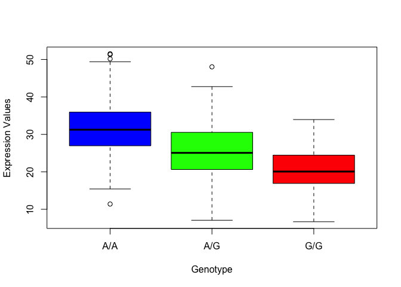
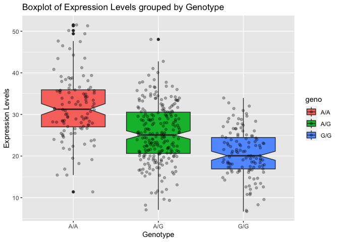

# Class 12 Homework: Population Scale Analysis
Christopher Brockie (PID: A16280405)

One sample is obviously not enough to know what is happening in a
population. You are interested in assessing genetic differences on a
population scale.

So, you processed about ~230 samples and did the normalization on a
genome level. Now, you want to find whether there is any association of
the 4 asthma-associated SNPs (rs8067378…) on ORMDL3 expression.

> Q13: Read this file into R and determine the sample size for each
> genotype and their corresponding median expression levels for each of
> these genotypes.

``` r
#Read file into R
expr <- read.table("rs8067378_ENSG00000172057.6.txt")

#Look at the first six rows of the table
head(expr)
```

       sample geno      exp
    1 HG00367  A/G 28.96038
    2 NA20768  A/G 20.24449
    3 HG00361  A/A 31.32628
    4 HG00135  A/A 34.11169
    5 NA18870  G/G 18.25141
    6 NA11993  A/A 32.89721

``` r
#How many total individuals in this experiment?
nrow(expr)
```

    [1] 462

``` r
#Sample size for each genotype:
table(expr$geno)
```


    A/A A/G G/G 
    108 233 121 

To find the median expression levels for each genotype, we can use the
`boxplot()` and

``` r
#Convert the `expr` table into a data frame
exprdf <- as.data.frame(expr)

#Designate the `geno` column as a factor so that we can use the boxplot function
genofactor <- as.factor(exprdf$geno)

#Create a boxplot of expression values for each genotype and save it as an R object
exprplot <- boxplot(exp ~ genofactor, data=exprdf, xlab="Genotype", ylab="Expression Values", col=c("blue", "green", "red"))
```



``` r
exprplot
```

    $stats
             [,1]     [,2]     [,3]
    [1,] 15.42908  7.07505  6.67482
    [2,] 26.95022 20.62572 16.90256
    [3,] 31.24847 25.06486 20.07363
    [4,] 35.95503 30.55183 24.45672
    [5,] 49.39612 42.75662 33.95602

    $n
    [1] 108 233 121

    $conf
             [,1]     [,2]     [,3]
    [1,] 29.87942 24.03742 18.98858
    [2,] 32.61753 26.09230 21.15868

    $out
    [1] 51.51787 50.16704 51.30170 11.39643 48.03410

    $group
    [1] 1 1 1 1 2

    $names
    [1] "A/A" "A/G" "G/G"

``` r
#Use the summary function to display the features of the boxplot numerically
summary(exprplot)
```

          Length Class  Mode     
    stats 15     -none- numeric  
    n      3     -none- numeric  
    conf   6     -none- numeric  
    out    5     -none- numeric  
    group  5     -none- numeric  
    names  3     -none- character

The quartile summaries are shown in the `$stats` grouping above. The
column numbers represent each genotype, and the row numbers represent
the different quartiles. In this case, the median value is represented
by row three. Thus, the median expression level for each genotype can be
called from row three.

``` r
#Median expression level for the A/A genotype
exprplot$stats[3,1]
```

    [1] 31.24847

``` r
#Median expression level for the A/G genotype
exprplot$stats[3,2]
```

    [1] 25.06486

``` r
#Median expression level for the G/G genotype
exprplot$stats[3,3]
```

    [1] 20.07363

> Q14: Generate a boxplot with a box per genotype, what could you infer
> from the relative expression value between A/A and G/G displayed in
> this plot? Does the SNP effect the expression of ORMDL3?

``` r
#Call ggplot
library(ggplot2)

#Make a boxplot using ggplot
ggplot(expr) +
  aes(x=geno, y=exp, fill=geno) +
  geom_boxplot(notch=TRUE) +
  geom_jitter(width=0.25, alpha=0.3) +
  labs(title="Boxplot of Expression Levels grouped by Genotype", x="Genotype", y="Expression Levels") +
  theme_get()
```



This boxplot reveals that the G/G SNP results in reduced expression of
the ORMDL3 gene.
