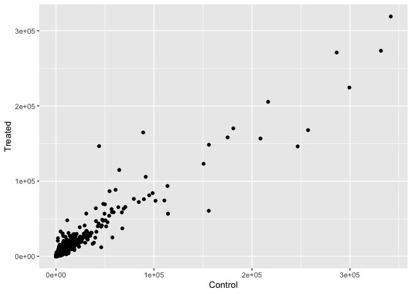
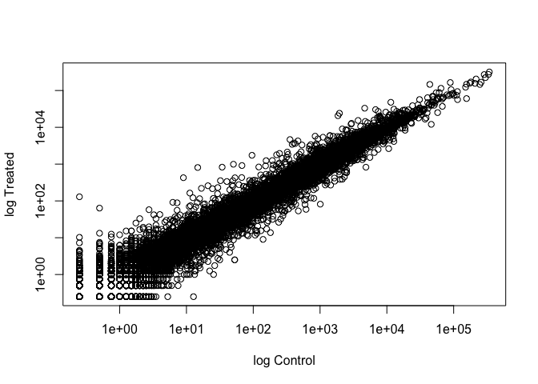

# Class 13: Transcriptomics and the analysis of RNA-seq data
Christopher Brockie (PID: A16280405)

## Background

The data for this hands-on session comes from a published RNA-seq
experiment where airway smooth muscle cells were treated with
dexamethasone, a synthetic glucocorticoid steroid with anti-inflammatory
effects. Glucocorticoids are used, for example, by people with asthma to
reduce inflammation of the airways.

## Bioconductor setup

We must install the `bioconductor` and `DESeq2` packages using the
commands below. Remember that `install.packages()` should only be used
in the R brain.

``` r
#install.packages("BiocManager")
#BiocManager::install()

#BiocManager::install("DESeq2")
```

As input, the DESeq2 package expects (1) a data.frame of `countData` (as
obtained from RNA-seq or another high-throughput sequencing experiment)
and (2) a second data.frame with information about the samples - often
called sample metadata (or `colData` in DESeq2-speak because it supplies
metadata/information about the columns of the countData matrix.

## Importing countData and colData

We use the read.csv() function to read the count data and metadata files
after downloading them into our project directories.

``` r
counts <- read.csv("airway_scaledcounts.csv", row.names=1)
metadata <- read.csv("airway_metadata.csv")
```

Now, take a look at the head of each.

``` r
head(counts)
```

                    SRR1039508 SRR1039509 SRR1039512 SRR1039513 SRR1039516
    ENSG00000000003        723        486        904        445       1170
    ENSG00000000005          0          0          0          0          0
    ENSG00000000419        467        523        616        371        582
    ENSG00000000457        347        258        364        237        318
    ENSG00000000460         96         81         73         66        118
    ENSG00000000938          0          0          1          0          2
                    SRR1039517 SRR1039520 SRR1039521
    ENSG00000000003       1097        806        604
    ENSG00000000005          0          0          0
    ENSG00000000419        781        417        509
    ENSG00000000457        447        330        324
    ENSG00000000460         94        102         74
    ENSG00000000938          0          0          0

``` r
head(metadata)
```

              id     dex celltype     geo_id
    1 SRR1039508 control   N61311 GSM1275862
    2 SRR1039509 treated   N61311 GSM1275863
    3 SRR1039512 control  N052611 GSM1275866
    4 SRR1039513 treated  N052611 GSM1275867
    5 SRR1039516 control  N080611 GSM1275870
    6 SRR1039517 treated  N080611 GSM1275871

> Q1. How many genes are in this dataset?

``` r
nrow(counts)
```

    [1] 38694

> Q2. How many ‘control’ cell lines do we have?

``` r
nrow(metadata[metadata$"dex" == "control", ])
```

    [1] 4

## Toy Differential Gene Expression

Lets perform some exploratory differential gene expression analysis.

Look at the metadata object again to see which samples are control and
which are drug treated. You can also see this in the metadata printed
table below:

``` r
metadata
```

              id     dex celltype     geo_id
    1 SRR1039508 control   N61311 GSM1275862
    2 SRR1039509 treated   N61311 GSM1275863
    3 SRR1039512 control  N052611 GSM1275866
    4 SRR1039513 treated  N052611 GSM1275867
    5 SRR1039516 control  N080611 GSM1275870
    6 SRR1039517 treated  N080611 GSM1275871
    7 SRR1039520 control  N061011 GSM1275874
    8 SRR1039521 treated  N061011 GSM1275875

Note that the control samples are SRR1039508, SRR1039512, SRR1039516,
and SRR1039520. Here we will first find the sample id for those labeled
control, and then calculate the mean counts per gene across these
samples:

``` r
control <- metadata[metadata[,"dex"]=="control",]
control.counts <- counts[ ,control$id]
control.mean <- rowSums( control.counts )/4 
head(control.mean)
```

    ENSG00000000003 ENSG00000000005 ENSG00000000419 ENSG00000000457 ENSG00000000460 
             900.75            0.00          520.50          339.75           97.25 
    ENSG00000000938 
               0.75 

An alternative way to do this same thing using the dplyr package from
the tidyverse is shown below.

``` r
library(dplyr)
```

``` r
control <- metadata %>% filter(dex=="control")
control.counts <- counts %>% select(control$id) 
control.mean <- rowSums(control.counts)/4
head(control.mean)
```

    ENSG00000000003 ENSG00000000005 ENSG00000000419 ENSG00000000457 ENSG00000000460 
             900.75            0.00          520.50          339.75           97.25 
    ENSG00000000938 
               0.75 

> Q3. How would you make the above code in either approach more robust?
> Is there a function that could help here?

**rowSums()**

> Q4. Follow the same procedure for the treated samples (i.e. calculate
> the mean per gene across drug treated samples and assign to a labeled
> vector called treated.mean.

``` r
treated <- metadata[metadata[,"dex"]=="treated",]
treated.mean <- rowSums( counts[ ,treated$id] )/4
head(treated.mean)
```

    ENSG00000000003 ENSG00000000005 ENSG00000000419 ENSG00000000457 ENSG00000000460 
             658.00            0.00          546.00          316.50           78.75 
    ENSG00000000938 
               0.00 

We will combine our meancount data for bookkeeping purposes.

``` r
meancounts <- data.frame(control.mean, treated.mean)
```

Use `colSums()` for the data to show the sum of the mean counts across
all genes for each group.

``` r
colSums(meancounts)
```

    control.mean treated.mean 
        23005324     22196524 

> Q5 (a). Create a scatter plot showing the mean of the treated samples
> against the mean of the control samples. Your plot should look
> something like the following.

``` r
plot(control.mean, treated.mean, xlab="Control", ylab="Treated")
```


> Q5 (b).You could also use the ggplot2 package to make this figure
> producing the plot below. What `geom_?()` function would you use for
> this plot?

``` r
library(ggplot2)

ggplot(meancounts, aes(x=control.mean, y=treated.mean)) +
  geom_point() +
  labs(x="Control", y="Treated")
```



Wait a sec. There are 60,000-some rows in this data, but I’m only seeing
a few dozen dots at most outside of the big clump around the origin.

> Q6. Try plotting both axes on a log scale. What is the argument to
> `plot()` that allows you to do this?

``` r
plot(control.mean, treated.mean, log="xy", xlab="log Control", ylab="log Treated")
```

    Warning in xy.coords(x, y, xlabel, ylabel, log): 15032 x values <= 0 omitted
    from logarithmic plot

    Warning in xy.coords(x, y, xlabel, ylabel, log): 15281 y values <= 0 omitted
    from logarithmic plot



We can find candidate differentially expressed genes by looking for
genes with a large change between control and dex-treated samples. We
usually look at the log2 of the fold change, because this has better
mathematical properties.

Here we calculate log2foldchange, add it to our meancounts data.frame
and inspect the results either with the `head()` or the `View()`
function.

``` r
meancounts$log2fc <- log2(meancounts[,"treated.mean"]/meancounts[,"control.mean"])
head(meancounts)
```

                    control.mean treated.mean      log2fc
    ENSG00000000003       900.75       658.00 -0.45303916
    ENSG00000000005         0.00         0.00         NaN
    ENSG00000000419       520.50       546.00  0.06900279
    ENSG00000000457       339.75       316.50 -0.10226805
    ENSG00000000460        97.25        78.75 -0.30441833
    ENSG00000000938         0.75         0.00        -Inf

There are a couple of “weird” results. Namely, the *NaN (“not a
number”)* and *-Inf (negative infinity)* results.

The NaN is returned when you divide by zero and try to take the log. The
-Inf is returned when you try to take the log of zero. It turns out that
there are a lot of genes with zero expression. Let’s filter our data to
remove these genes. Again inspect your result (and the intermediate
steps) to see if things make sense to you

``` r
zero.vals <- which(meancounts[,1:2]==0, arr.ind=TRUE)

to.rm <- unique(zero.vals[,1])
mycounts <- meancounts[-to.rm,]
head(mycounts)
```

                    control.mean treated.mean      log2fc
    ENSG00000000003       900.75       658.00 -0.45303916
    ENSG00000000419       520.50       546.00  0.06900279
    ENSG00000000457       339.75       316.50 -0.10226805
    ENSG00000000460        97.25        78.75 -0.30441833
    ENSG00000000971      5219.00      6687.50  0.35769358
    ENSG00000001036      2327.00      1785.75 -0.38194109

> Q7. What is the purpose of the `arr.ind` argument in the `which()`
> function call above? Why would we then take the first column of the
> output and need to call the `unique()` function?

**The arr.ind argument in the which() function returns the columns and
rows, i.e. the genes and samples, where the count is zero. The unique()
function ensures that we don’t count any row twice if both genes and
samples have a zero count**

A common threshold used for calling something differentially expressed
is a log2(FoldChange) of greater than 2 or less than -2. Let’s filter
the dataset both ways to see how many genes are up or down-regulated.

``` r
up.ind <- mycounts$log2fc > 2
down.ind <- mycounts$log2fc < (-2)
```

> Q8. Using the up.ind vector above can you determine how many up
> regulated genes we have at the greater than 2 fc level?

``` r
sum(up.ind)
```

    [1] 250

> Q9. Using the down.ind vector above can you determine how many down
> regulated genes we have at the greater than 2 fc level?

``` r
sum(down.ind)
```

    [1] 367

> Q10. Do you trust these results? Why or why not?

**No, we do not know if this difference is statistically significant**

## Setting up for DESeq

DESeq2 is an R package specifically for analyzing count-based NGS data
like RNA-seq. It is available from Bioconductor.

Just like R packages from CRAN, you only need to install Bioconductor
packages once, then load them every time you start a new R session.

``` r
library(DESeq2)
citation("DESeq2")
```

    To cite package 'DESeq2' in publications use:

      Love, M.I., Huber, W., Anders, S. Moderated estimation of fold change
      and dispersion for RNA-seq data with DESeq2 Genome Biology 15(12):550
      (2014)

    A BibTeX entry for LaTeX users is

      @Article{,
        title = {Moderated estimation of fold change and dispersion for RNA-seq data with DESeq2},
        author = {Michael I. Love and Wolfgang Huber and Simon Anders},
        year = {2014},
        journal = {Genome Biology},
        doi = {10.1186/s13059-014-0550-8},
        volume = {15},
        issue = {12},
        pages = {550},
      }

We will use the `DESeqDataSetFromMatrix()` function to build the
required DESeqDataSet object and call it *dds*, short for our
DESeqDataSet. If you get a warning about “some variables in design
formula are characters, converting to factors” don’t worry about it.
Take a look at the dds object once you create it.

``` r
dds <- DESeqDataSetFromMatrix(countData=counts, 
                              colData=metadata, 
                              design=~dex)
```

    converting counts to integer mode

    Warning in DESeqDataSet(se, design = design, ignoreRank): some variables in
    design formula are characters, converting to factors

``` r
dds
```

    class: DESeqDataSet 
    dim: 38694 8 
    metadata(1): version
    assays(1): counts
    rownames(38694): ENSG00000000003 ENSG00000000005 ... ENSG00000283120
      ENSG00000283123
    rowData names(0):
    colnames(8): SRR1039508 SRR1039509 ... SRR1039520 SRR1039521
    colData names(4): id dex celltype geo_id

## Principal Component Analysis

Before running DESeq analysis we can look how the count data samples are
related to one another via our old friend Principal Component Analysis
(PCA). We will follow the DESeq recommended procedure and associated
functions for PCA. First calling `vst()` to apply a variance stabilizing
transformation (read more about this in the expandable section below)
and then `plotPCA()` to calculate our PCs and plot the results.

``` r
vsd <- vst(dds, blind = FALSE)
plotPCA(vsd, intgroup = c("dex"))
```

    using ntop=500 top features by variance


The `plotPCA()` function comes with DESeq2 and intgroup are our dex
groups for labeling the samples; they tell the function to use them to
choose colors.

We can also build the PCA plot from scratch using the ggplot2 package.
This is done by asking the plotPCA function to return the data used for
plotting rather than building the plot.

``` r
pcaData <- plotPCA(vsd, intgroup=c("dex"), returnData=TRUE)
```

    using ntop=500 top features by variance

``` r
head(pcaData)
```

                      PC1        PC2   group     dex       name
    SRR1039508 -17.607922 -10.225252 control control SRR1039508
    SRR1039509   4.996738  -7.238117 treated treated SRR1039509
    SRR1039512  -5.474456  -8.113993 control control SRR1039512
    SRR1039513  18.912974  -6.226041 treated treated SRR1039513
    SRR1039516 -14.729173  16.252000 control control SRR1039516
    SRR1039517   7.279863  21.008034 treated treated SRR1039517

``` r
# Calculate percent variance per PC for the plot axis labels
percentVar <- round(100 * attr(pcaData, "percentVar"))

#Create the plot
ggplot(pcaData) +
  aes(x = PC1, y = PC2, color = dex) +
  geom_point(size =3) +
  xlab(paste0("PC1: ", percentVar[1], "% variance")) +
  ylab(paste0("PC2: ", percentVar[2], "% variance")) +
  coord_fixed() +
  theme_bw()
```


## DESeq Analysis

The `DESeq()` function takes a DESeqDataSet and returns a DESeqDataSet,
but with additional information filled in (including the differential
expression results we are after).

Notice how if we try to access these results before running the
analysis, nothing exists.

``` r
#results(dds)
```

Here, we’re running the DESeq pipeline on the dds object, and
reassigning the whole thing back to dds, which will now be a
DESeqDataSet populated with all those values.

``` r
dds <- DESeq(dds)
```

    estimating size factors

    estimating dispersions

    gene-wise dispersion estimates

    mean-dispersion relationship

    final dispersion estimates

    fitting model and testing

We can get results out of the object simply by calling the `results()`
function on the DESeqDataSet that has been run through the pipeline.

``` r
res <- results(dds)
res
```

    log2 fold change (MLE): dex treated vs control 
    Wald test p-value: dex treated vs control 
    DataFrame with 38694 rows and 6 columns
                     baseMean log2FoldChange     lfcSE      stat    pvalue
                    <numeric>      <numeric> <numeric> <numeric> <numeric>
    ENSG00000000003  747.1942     -0.3507030  0.168246 -2.084470 0.0371175
    ENSG00000000005    0.0000             NA        NA        NA        NA
    ENSG00000000419  520.1342      0.2061078  0.101059  2.039475 0.0414026
    ENSG00000000457  322.6648      0.0245269  0.145145  0.168982 0.8658106
    ENSG00000000460   87.6826     -0.1471420  0.257007 -0.572521 0.5669691
    ...                   ...            ...       ...       ...       ...
    ENSG00000283115  0.000000             NA        NA        NA        NA
    ENSG00000283116  0.000000             NA        NA        NA        NA
    ENSG00000283119  0.000000             NA        NA        NA        NA
    ENSG00000283120  0.974916      -0.668258   1.69456 -0.394354  0.693319
    ENSG00000283123  0.000000             NA        NA        NA        NA
                         padj
                    <numeric>
    ENSG00000000003  0.163035
    ENSG00000000005        NA
    ENSG00000000419  0.176032
    ENSG00000000457  0.961694
    ENSG00000000460  0.815849
    ...                   ...
    ENSG00000283115        NA
    ENSG00000283116        NA
    ENSG00000283119        NA
    ENSG00000283120        NA
    ENSG00000283123        NA

We can summarize some basic tallies using the summary function.

``` r
summary(res)
```


    out of 25258 with nonzero total read count
    adjusted p-value < 0.1
    LFC > 0 (up)       : 1563, 6.2%
    LFC < 0 (down)     : 1188, 4.7%
    outliers [1]       : 142, 0.56%
    low counts [2]     : 9971, 39%
    (mean count < 10)
    [1] see 'cooksCutoff' argument of ?results
    [2] see 'independentFiltering' argument of ?results

The results function contains a number of arguments to customize the
results table. By default the argument alpha is set to 0.1. If the
adjusted p value cutoff will be a value other than 0.1, alpha should be
set to that value:

``` r
res05 <- results(dds, alpha=0.05)
summary(res05)
```


    out of 25258 with nonzero total read count
    adjusted p-value < 0.05
    LFC > 0 (up)       : 1236, 4.9%
    LFC < 0 (down)     : 933, 3.7%
    outliers [1]       : 142, 0.56%
    low counts [2]     : 9033, 36%
    (mean count < 6)
    [1] see 'cooksCutoff' argument of ?results
    [2] see 'independentFiltering' argument of ?results

## Adding Annotation Data

Our result table so far only contains the Ensembl gene IDs. However,
alternative gene names and extra annotation are usually required for
informative interpretation of our results. In this section we will add
this necessary annotation data to our results.

We will use one of Bioconductor’s main annotation packages to help with
mapping between various ID schemes. Here we load the AnnotationDbi
package and the annotation data package for humans org.Hs.eg.db.

``` r
library("AnnotationDbi")
```

    Warning: package 'AnnotationDbi' was built under R version 4.3.2


    Attaching package: 'AnnotationDbi'

    The following object is masked from 'package:dplyr':

        select

``` r
library("org.Hs.eg.db")
```

The later of these is is the organism annotation package (“org”) for
Homo sapiens (“Hs”), organized as an AnnotationDbi database package
(“db”), using Entrez Gene IDs (“eg”) as primary key. To get a list of
all available key types that we can use to map between, use the
`columns()` function:

``` r
columns(org.Hs.eg.db)
```

     [1] "ACCNUM"       "ALIAS"        "ENSEMBL"      "ENSEMBLPROT"  "ENSEMBLTRANS"
     [6] "ENTREZID"     "ENZYME"       "EVIDENCE"     "EVIDENCEALL"  "GENENAME"    
    [11] "GENETYPE"     "GO"           "GOALL"        "IPI"          "MAP"         
    [16] "OMIM"         "ONTOLOGY"     "ONTOLOGYALL"  "PATH"         "PFAM"        
    [21] "PMID"         "PROSITE"      "REFSEQ"       "SYMBOL"       "UCSCKG"      
    [26] "UNIPROT"     

The main function we will use from the AnnotationDbi package is called
`mapIds()`. We can use the `mapIds()` function to add individual columns
to our results table.

``` r
res$symbol <- mapIds(org.Hs.eg.db,
                     keys=row.names(res), # Our genenames
                     keytype="ENSEMBL",   # The format of our genenames
                     column="SYMBOL",     # The new format we want to add
                     multiVals="first")
```

    'select()' returned 1:many mapping between keys and columns

``` r
head(res)
```

    log2 fold change (MLE): dex treated vs control 
    Wald test p-value: dex treated vs control 
    DataFrame with 6 rows and 7 columns
                      baseMean log2FoldChange     lfcSE      stat    pvalue
                     <numeric>      <numeric> <numeric> <numeric> <numeric>
    ENSG00000000003 747.194195     -0.3507030  0.168246 -2.084470 0.0371175
    ENSG00000000005   0.000000             NA        NA        NA        NA
    ENSG00000000419 520.134160      0.2061078  0.101059  2.039475 0.0414026
    ENSG00000000457 322.664844      0.0245269  0.145145  0.168982 0.8658106
    ENSG00000000460  87.682625     -0.1471420  0.257007 -0.572521 0.5669691
    ENSG00000000938   0.319167     -1.7322890  3.493601 -0.495846 0.6200029
                         padj      symbol
                    <numeric> <character>
    ENSG00000000003  0.163035      TSPAN6
    ENSG00000000005        NA        TNMD
    ENSG00000000419  0.176032        DPM1
    ENSG00000000457  0.961694       SCYL3
    ENSG00000000460  0.815849       FIRRM
    ENSG00000000938        NA         FGR

> Q11. Run the mapIds() function two more times to add the Entrez ID and
> UniProt accession and GENENAME as new columns called
> res$entrez, res$uniprot and res\$genename.

``` r
res$entrez <- mapIds(org.Hs.eg.db,
                     keys=row.names(res),
                     column="ENTREZID",
                     keytype="ENSEMBL",
                     multiVals="first")
```

    'select()' returned 1:many mapping between keys and columns

``` r
res$uniprot <- mapIds(org.Hs.eg.db,
                     keys=row.names(res),
                     column="UNIPROT",
                     keytype="ENSEMBL",
                     multiVals="first")
```

    'select()' returned 1:many mapping between keys and columns

``` r
res$genename <- mapIds(org.Hs.eg.db,
                     keys=row.names(res),
                     column="GENENAME",
                     keytype="ENSEMBL",
                     multiVals="first")
```

    'select()' returned 1:many mapping between keys and columns

``` r
head(res)
```

    log2 fold change (MLE): dex treated vs control 
    Wald test p-value: dex treated vs control 
    DataFrame with 6 rows and 10 columns
                      baseMean log2FoldChange     lfcSE      stat    pvalue
                     <numeric>      <numeric> <numeric> <numeric> <numeric>
    ENSG00000000003 747.194195     -0.3507030  0.168246 -2.084470 0.0371175
    ENSG00000000005   0.000000             NA        NA        NA        NA
    ENSG00000000419 520.134160      0.2061078  0.101059  2.039475 0.0414026
    ENSG00000000457 322.664844      0.0245269  0.145145  0.168982 0.8658106
    ENSG00000000460  87.682625     -0.1471420  0.257007 -0.572521 0.5669691
    ENSG00000000938   0.319167     -1.7322890  3.493601 -0.495846 0.6200029
                         padj      symbol      entrez     uniprot
                    <numeric> <character> <character> <character>
    ENSG00000000003  0.163035      TSPAN6        7105  A0A024RCI0
    ENSG00000000005        NA        TNMD       64102      Q9H2S6
    ENSG00000000419  0.176032        DPM1        8813      O60762
    ENSG00000000457  0.961694       SCYL3       57147      Q8IZE3
    ENSG00000000460  0.815849       FIRRM       55732  A0A024R922
    ENSG00000000938        NA         FGR        2268      P09769
                                  genename
                               <character>
    ENSG00000000003          tetraspanin 6
    ENSG00000000005            tenomodulin
    ENSG00000000419 dolichyl-phosphate m..
    ENSG00000000457 SCY1 like pseudokina..
    ENSG00000000460 FIGNL1 interacting r..
    ENSG00000000938 FGR proto-oncogene, ..

You can arrange and view the results by the adjusted p-value:

``` r
ord <- order( res$padj )

#View(res[ord,])
head(res[ord,])
```

    log2 fold change (MLE): dex treated vs control 
    Wald test p-value: dex treated vs control 
    DataFrame with 6 rows and 10 columns
                     baseMean log2FoldChange     lfcSE      stat      pvalue
                    <numeric>      <numeric> <numeric> <numeric>   <numeric>
    ENSG00000152583   954.771        4.36836 0.2371268   18.4220 8.74490e-76
    ENSG00000179094   743.253        2.86389 0.1755693   16.3120 8.10784e-60
    ENSG00000116584  2277.913       -1.03470 0.0650984  -15.8944 6.92855e-57
    ENSG00000189221  2383.754        3.34154 0.2124058   15.7319 9.14433e-56
    ENSG00000120129  3440.704        2.96521 0.2036951   14.5571 5.26424e-48
    ENSG00000148175 13493.920        1.42717 0.1003890   14.2164 7.25128e-46
                           padj      symbol      entrez     uniprot
                      <numeric> <character> <character> <character>
    ENSG00000152583 1.32441e-71     SPARCL1        8404  A0A024RDE1
    ENSG00000179094 6.13966e-56        PER1        5187      O15534
    ENSG00000116584 3.49776e-53     ARHGEF2        9181      Q92974
    ENSG00000189221 3.46227e-52        MAOA        4128      P21397
    ENSG00000120129 1.59454e-44       DUSP1        1843      B4DU40
    ENSG00000148175 1.83034e-42        STOM        2040      F8VSL7
                                  genename
                               <character>
    ENSG00000152583           SPARC like 1
    ENSG00000179094 period circadian reg..
    ENSG00000116584 Rho/Rac guanine nucl..
    ENSG00000189221    monoamine oxidase A
    ENSG00000120129 dual specificity pho..
    ENSG00000148175               stomatin

Finally, let’s write out the ordered significant results with
annotations.

``` r
write.csv(res[ord,], "deseq_results.csv")
```

## Data Visualization

*Volcano Plots* are frequently used to highlight the proportion of genes
that are both significantly regulated and display a high fold change.

Typically these plots shows the log fold change on the X-axis, and the
-log10 of the p-value on the Y-axis (the more significant the p-value,
the larger the -log10 of that value will be).

``` r
plot( res$log2FoldChange,  -log(res$padj), 
      xlab="Log2(FoldChange)",
      ylab="-Log(P-value)")
```


To make this more useful we can add some guidelines (with the `abline()`
function) and color (with a custom color vector) highlighting genes that
have padj\<0.05 and the absolute log2FoldChange\>2.

``` r
plot( res$log2FoldChange,  -log(res$padj), 
 ylab="-Log(P-value)", xlab="Log2(FoldChange)")

# Add some cut-off lines
abline(v=c(-2,2), col="darkgray", lty=2)
abline(h=-log(0.05), col="darkgray", lty=2)
```


To color the points we will setup a custom color vector indicating
transcripts with large fold change and significant differences between
conditions:

``` r
# Setup our custom point color vector 
mycols <- rep("gray", nrow(res))
mycols[ abs(res$log2FoldChange) > 2 ]  <- "red" 

inds <- (res$padj < 0.01) & (abs(res$log2FoldChange) > 2 )
mycols[ inds ] <- "blue"

# Volcano plot with custom colors 
plot( res$log2FoldChange,  -log(res$padj), 
 col=mycols, ylab="-Log(P-value)", xlab="Log2(FoldChange)" )

# Cut-off lines
abline(v=c(-2,2), col="gray", lty=2)
abline(h=-log(0.1), col="gray", lty=2)
```


For even more customization you might find the EnhancedVolcano
bioconductor package useful (Note. It uses ggplot under the hood):

First we will add the more understandable gene symbol names to our full
results object res as we will use this to label the most interesting
genes in our final plot.

``` r
library(EnhancedVolcano)
```

    Loading required package: ggrepel

``` r
x <- as.data.frame(res)

EnhancedVolcano(x,
    lab = x$symbol,
    x = 'log2FoldChange',
    y = 'pvalue')
```


## Pathway Analysis

We will use the **gage** package along with **pathview** here to do
geneset enrichment (a.k.a. pathway analysis) and figure generation
respectively.

``` r
library(pathview)
library(gage)
library(gageData)
```

Lets have a peak at the first two pathways in KEGG

``` r
data(kegg.sets.hs)

# Examine the first 2 pathways in this kegg set for humans
head(kegg.sets.hs, 2)
```

    $`hsa00232 Caffeine metabolism`
    [1] "10"   "1544" "1548" "1549" "1553" "7498" "9"   

    $`hsa00983 Drug metabolism - other enzymes`
     [1] "10"     "1066"   "10720"  "10941"  "151531" "1548"   "1549"   "1551"  
     [9] "1553"   "1576"   "1577"   "1806"   "1807"   "1890"   "221223" "2990"  
    [17] "3251"   "3614"   "3615"   "3704"   "51733"  "54490"  "54575"  "54576" 
    [25] "54577"  "54578"  "54579"  "54600"  "54657"  "54658"  "54659"  "54963" 
    [33] "574537" "64816"  "7083"   "7084"   "7172"   "7363"   "7364"   "7365"  
    [41] "7366"   "7367"   "7371"   "7372"   "7378"   "7498"   "79799"  "83549" 
    [49] "8824"   "8833"   "9"      "978"   

What we need for `gage()` is our genes in ENTREZ id format with a
measure of their importance.

It wants a vector of e.g. fold-changes.

``` r
foldchanges <- res$log2FoldChange
head(foldchanges)
```

    [1] -0.35070302          NA  0.20610777  0.02452695 -0.14714205 -1.73228897

Add ENTREZ ids as `names()` to my `foldchanges` vector.

``` r
names(foldchanges) <- res$entrez
head(foldchanges)
```

           7105       64102        8813       57147       55732        2268 
    -0.35070302          NA  0.20610777  0.02452695 -0.14714205 -1.73228897 

Now we can run `gage()` with this input vector and the genset we want to
examine for overlap/enrichment…

``` r
# Get the results
keggres = gage(foldchanges, gsets=kegg.sets.hs)
```

Look at the results

``` r
attributes(keggres)
```

    $names
    [1] "greater" "less"    "stats"  

``` r
head(keggres$less, 3)
```

                                          p.geomean stat.mean        p.val
    hsa05332 Graft-versus-host disease 0.0004250461 -3.473346 0.0004250461
    hsa04940 Type I diabetes mellitus  0.0017820293 -3.002352 0.0017820293
    hsa05310 Asthma                    0.0020045888 -3.009050 0.0020045888
                                            q.val set.size         exp1
    hsa05332 Graft-versus-host disease 0.09053483       40 0.0004250461
    hsa04940 Type I diabetes mellitus  0.14232581       42 0.0017820293
    hsa05310 Asthma                    0.14232581       29 0.0020045888

We can view these pathways with our geneset genes highlighted using
`pathview()` function. E.g. for Asthma I wil use the pathway.id hsa05310
as seen above.

``` r
pathview(gene.data=foldchanges, pathway.id="hsa05310")
```


