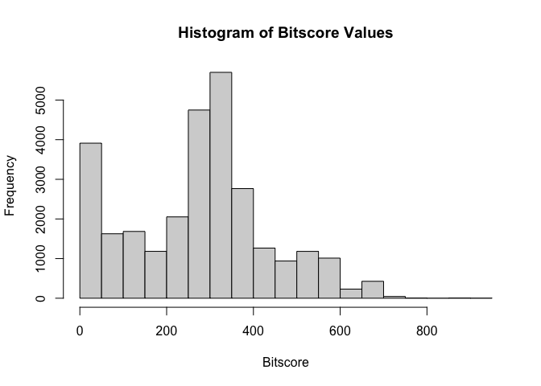
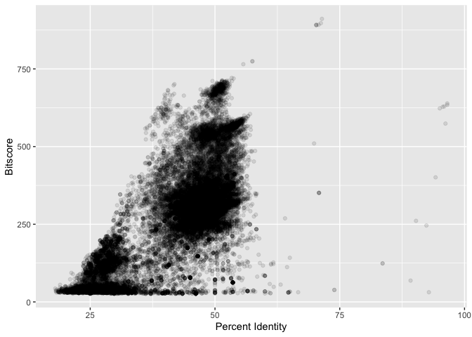
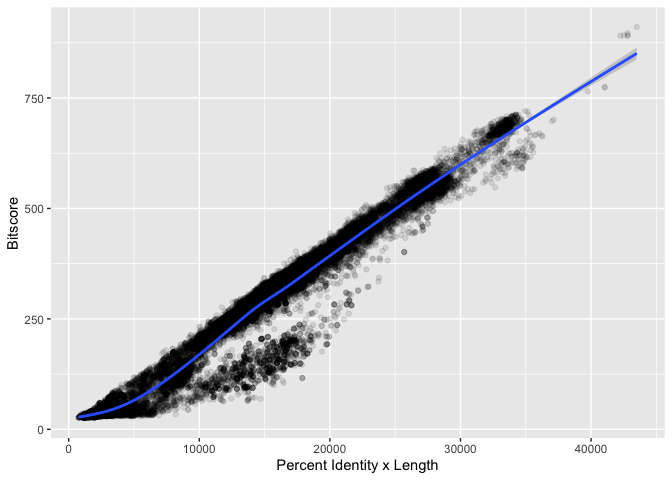

# HW Class 17: UNIX Basics
Christopher Brockie (PID A16280405)

# Using RStudio to read your output

Read the zebrafish output file:

``` r
zebrafish <- read.table("mm-second.x.zebrafish.tsv", col.names = c("qseqid", "sseqid", "pident", "length", "mismatch", "gapopen", "qstart", "qend", "sstart", "send", "evalue", "bitscore"))
```

Check to ensure table has been read correctly:

``` r
head(zebrafish)
```

           qseqid         sseqid pident length mismatch gapopen qstart qend sstart
    1 NP_598866.1 XP_009294521.1 46.154    273      130       6      4  267    420
    2 NP_598866.1 NP_001313634.1 46.154    273      130       6      4  267    476
    3 NP_598866.1 XP_009294513.1 46.154    273      130       6      4  267    475
    4 NP_598866.1 NP_001186666.1 33.071    127       76       5      4  126    338
    5 NP_598866.1 NP_001003517.1 30.400    125       82       4      4  126    344
    6 NP_598866.1 NP_001003517.1 30.645     62       41       2     53  113     43
      send   evalue bitscore
    1  684 1.70e-63    214.0
    2  740 4.51e-63    214.0
    3  739 4.69e-63    214.0
    4  459 5.19e-12     67.8
    5  465 2.67e-11     65.5
    6  103 4.40e-01     33.9

Make a histogram of the `bitscore` values:

``` r
hist(zebrafish$bitscore, breaks = 30, xlab = "Bitscore", ylab = "Frequency", main = "Histogram of Bitscore Values")
```



Most of the `bitscore` values are on the lower side.

`bitscores` are only somewhat related to `pident`; they take into
account not only the percent identity but the length of the alignment.
This relationship can be estimated by the following napkin sketches:

``` r
library(ggplot2)
ggplot(zebrafish, aes(pident, bitscore,)) + 
  geom_point(alpha=0.1) +
  labs(x="Percent Identity", y="Bitscore")
```



``` r
ggplot(zebrafish, aes((pident * (qend - qstart)), bitscore)) + 
  geom_point(alpha=0.1) + 
  geom_smooth() +
  labs(x="Percent Identity x Length", y="Bitscore")
```

    `geom_smooth()` using method = 'gam' and formula = 'y ~ s(x, bs = "cs")'


